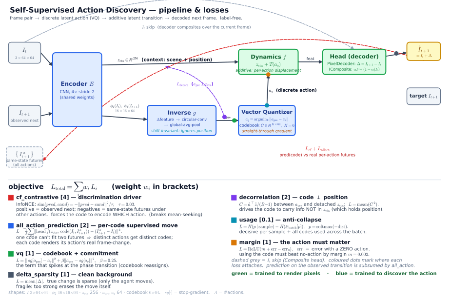

# Pipeline & losses — how the model learns actions, and why training jumps

This document explains the full self-supervised action-discovery pipeline: every component, the exact
math of every loss, what each loss does during training, and the (unusual) training dynamics we
observe — in particular the sharp *phase transition* where the model suddenly learns.

The component + loss diagram is in [`pipeline.svg`](./pipeline.svg) (regenerate with
`uv run python docs/build_pipeline_svg.py`).

Reference config throughout: `model=minimal_invariant_pixel`, `loss=pixel_clean`, `data.env.step=20`
— the toy is one red agent square that moves L/R/U/D by 20px over static distractor squares on a white
background; the action is hidden.

---

## 1. Goal

Learn, **without action labels**, a discrete code $a_q$ that (a) identifies which action occurred between
two frames and (b) drives a forward model that renders the correct next frame. Success $=$ the code
clusters by the true action (high NMI) **and** applying different codes to the same frame produces the
correct, distinct next frames (a faithful action-conditional counterfactual).

## 2. Notation & shapes

| symbol | meaning | shape |
|---|---|---|
| $I_t,\ I_{t+1}$ | one frame (agent red $[1,0,0]$, bg white) | $3\times64\times64$ |
| $\phi(I)$ | encoder feature map (final) | $256\times4\times4$ |
| $\phi_2(I)$ | encoder feature map (level 2) | $64\times16\times16$ |
| $z_{\text{ctx}}$ | context latent (scene + position) | $\mathbb{R}^{256}$ |
| $a_{\text{pre}}$ | pre-quantization action | $\mathbb{R}^{64}$ |
| $a_q$ | quantized action (a codebook row) | $\mathbb{R}^{64}$, code $\in\{0..K{-}1\}$ |
| $\text{feat}$ | dynamics output | $\mathbb{R}^{256}$ |

$\operatorname{sg}[\cdot]$ = stop-gradient; $A$ = number of same-state futures (observed + counterfactuals) $=4$; $K=6$ codes.

## 3. Components (the math)

### Encoder $E$  (`models/encoder.py`)
Four stride-2 conv blocks $[\text{Conv}\,4{\times}4 \to \text{GroupNorm}(8) \to \text{SiLU}]$, widths
$(32,64,128,256)$, so $64\to32\to16\to8\to4$.

$$\phi(I)=\text{features}(I)\in\mathbb{R}^{256\times4\times4},\qquad \phi_2(I)=\text{features}(I,\text{level}=2)\in\mathbb{R}^{64\times16\times16}$$
$$z_{\text{ctx}} = E(I_t) = W_{\text{proj}}\,\operatorname{flatten}\big(\phi(I_t)\big)\in\mathbb{R}^{256}$$

$z_{\text{ctx}}$ holds the whole scene, **including absolute position**.

### Inverse $g$  (`models/inverse.py`, `InvariantInverseModel`)
Infers the action from the **inter-frame feature difference**:

$$d = \phi_2(I_{t+1}) - \phi_2(I_t)\in\mathbb{R}^{64\times16\times16}$$
$$a_{\text{pre}} = W_g\,\Big[\underbrace{\tfrac{1}{HW}\textstyle\sum_{h,w}}_{\text{global pool}} \operatorname{ConvStack}_{\text{circular}}(d)\Big]\in\mathbb{R}^{64}$$

where $\operatorname{ConvStack}$ is $[\text{Conv}(64{\to}256) \to \text{GN} \to \text{SiLU} \to \text{Conv}(256{\to}256) \to \text{SiLU}]$ with **circular padding**.
Circular padding $\Rightarrow$ shift-**equivariant** conv; the global mean $\Rightarrow$ shift-**invariant** $a_{\text{pre}}$.
So $a_{\text{pre}}$ depends on *how* things moved, **not where the agent is** — the key to position-invariant discovery.

### Vector Quantizer $\mathrm{VQ}$  (`models/quantizer.py`)
Codebook $C=\{c_1,\dots,c_K\}\in\mathbb{R}^{K\times64}$.

$$\text{code}=\operatorname*{arg\,min}_k \|a_{\text{pre}}-c_k\|^2,\qquad a_q = c_{\text{code}}$$
$$\text{straight-through:}\quad a_q \leftarrow a_{\text{pre}} + \operatorname{sg}[\,a_q - a_{\text{pre}}\,]\quad\Rightarrow\quad \frac{\partial a_q}{\partial a_{\text{pre}}}=I$$

The forward pass uses $a_q$; the backward pass sends the gradient straight to $a_{\text{pre}}$ (bypassing
the non-differentiable $\arg\min$). The $\arg\min$ is the source of the non-smoothness in §6: the code
only changes when $a_{\text{pre}}$ crosses a Voronoi boundary.

### Dynamics $f$  (`models/dynamics.py`, additive)
$$\text{feat} = z_{\text{ctx}} + T(a_q),\qquad T=\text{Linear}(64{\to}256)\to\text{SiLU}\to\text{Linear}(256{\to}256)$$
$T$ sees the **action alone**, so $T(a_q)$ is a pure per-action displacement — capacity goes on the (small) action effect, not on re-predicting $z_{\text{ctx}}$.

### Head  (`models/heads.py`)
- **`PixelDecoder(delta=True)`** (reference): $\text{Linear}(256{\to}256{\cdot}8^2)\to$ reshape $\to 3{\times}[\text{ConvT}\,4{\times}4\text{ s2}\to\text{GN}\to\text{SiLU}]\ (8{\to}16{\to}32{\to}64)\to\text{Conv}\to\tanh$. Output is the **change** $\Delta\in[-1,1]^{3\times64\times64}$; predicted frame $\hat I_{t+1}=I_t+\Delta$; target $=I_{t+1}-I_t$.
- **`CompositePixelDecoder`** (artifact-free variant): predicts a frame $F$ (sigmoid) and a soft mask $\alpha$ (sigmoid); output $=\alpha F + (1-\alpha)I_t$; target $=I_{t+1}$. Copies the static scene verbatim from $I_t$, writes only the moved agent.

### Forward pass (`models/model.py`)
$$\phi_{\text{ctx}}=E.\text{features}(I_t),\quad z_{\text{ctx}}=E.\text{project}(\phi_{\text{ctx}})$$
$$a_{\text{pre}}=g\big(\phi_2(I_t),\,\phi_2(I_{t+1})\big),\quad a_q=\mathrm{VQ}(a_{\text{pre}}),\quad \text{feat}=z_{\text{ctx}}+T(a_q)$$
$$\text{pred}=\text{head}(\text{feat},I_t),\quad \text{target}=I_{t+1}-I_t\ \text{(delta)}\ \text{or}\ I_{t+1}\ \text{(composite)}$$

## 4. The losses (exact math + role)

$$\boxed{\,L_{\text{total}} = 4\,L_{\text{cf}} + 2\,L_{\text{allact}} + 1\,L_{\Delta} + 1\,L_{\text{vq}} + 1\,L_{\text{margin}} + 0.1\,L_{\text{usage}} + 2\,L_{\text{decorr}}\,}$$

**$L_{\text{cf}}$ — cf_contrastive $[4]$, the discrimination driver** (`losses/counterfactual.py`, pixel branch).
Pixel-space InfoNCE: the observed next-frame is the positive; the same-state counterfactual frames (agent
under *other* actions) are negatives.
$$\operatorname{sim}(\text{pred},\text{cand}) = -\frac{\|\text{pred}-\text{cand}\|^2}{\tau},\ \ \tau=0.03,\qquad
L_{\text{cf}} = -\log\frac{e^{\operatorname{sim}(\text{pred},\,\text{cand}^{+})}}{\sum_{j} e^{\operatorname{sim}(\text{pred},\,\text{cand}_j)}}$$
Forces $\text{pred}$ (which used the inferred code) closer to the *observed* future than to the
*counterfactual* futures — so the code **must** encode which action, and predictions **must** differ per
action. This breaks the mean-seeking symmetry (§6). At chance $L_{\text{cf}}=\ln A=\ln 4\approx 1.386$.

**$L_{\text{allact}}$ — all_action_prediction $[2]$, per-code supervised move** (`losses/all_action_prediction.py`).
Uses the counterfactuals as *supervision*: for every real future, infer its code and regress the
code-conditioned prediction onto that future's real change.
$$L_{\text{allact}}=\frac{1}{A}\sum_{a} \Big\| \text{head}\!\Big(f\big(z_{\text{ctx}},\,\mathrm{VQ}(g(\phi_2(I_t),\phi_2(I_{t+1}^{a})))\big),\,I_t\Big) - \big(I_{t+1}^{a}-I_t\big)\Big\|^2$$
One code cannot fit two different futures $\Rightarrow$ distinct actions get distinct codes; each code
learns to render its action's real move. (Subsumes plain prediction: the observed action is one of the $A$ futures.)

**$L_{\text{vq}}$ — vq $[1]$, codebook + commitment** (`losses/vq.py`).
$$L_{\text{vq}} = \underbrace{\|\operatorname{sg}[a_{\text{pre}}]-a_q\|^2}_{\text{codebook}} + \beta\underbrace{\|a_{\text{pre}}-\operatorname{sg}[a_q]\|^2}_{\text{commitment}},\qquad \beta=0.25$$
Pulls the chosen row toward $a_{\text{pre}}$ and $a_{\text{pre}}$ toward its code. **This term spikes at the phase transition** when codes reassign (§6).

**$L_{\text{margin}}$ — margin $[1]$, the action must matter** (`losses/margin.py`).
$$\text{err}=\|\text{pred}-\text{target}\|^2,\quad \text{err}_0=\|\text{head}(f(z_{\text{ctx}},\mathbf{0}),I_t)-\text{target}\|^2$$
$$L_{\text{margin}}=\operatorname{ReLU}\big(m + \text{err} - \text{err}_0\big),\qquad m=0.002$$
Predicting with the inferred code must beat the **zero-action** prediction by margin $m$ — the code has to *do something*.

**$L_{\text{usage}}$ — usage $[0.1]$, anti-collapse** (`losses/usage.py`).  With soft assignment $p=\operatorname{softmax}(-\text{dist})$:
$$L_{\text{usage}} = \underbrace{H\big(p \mid \text{sample}\big)}_{\text{decisive}\ \downarrow} - \underbrace{H\big(\mathbb{E}_{\text{batch}}[p]\big)}_{\text{all codes used}\ \uparrow}$$

**$L_{\text{decorr}}$ — decorrelation $[2]$, code $\perp$ position** (`losses/decorrelation.py`).
Barlow-Twins cross-correlation of z-scored $a_{\text{pre}}$ and z-scored, **detached** $z_{\text{ctx}}$:
$$C = \frac{\hat a^{\top}\hat z}{B-1}\in\mathbb{R}^{64\times256},\qquad L_{\text{decorr}}=\operatorname{mean}(C^{2})$$
Drives the code to carry information **not** in $z_{\text{ctx}}$ (which is dominated by absolute position). $z_{\text{ctx}}$ is detached, so this never degrades the encoder.

**$L_{\Delta}$ — delta_sparsity $[1]$, clean background** (`losses/delta_sparsity.py`, delta head only).
$$L_{\Delta}=\operatorname{mean}|\Delta|$$
The true change is sparse (only the agent moves), so this zeros out change at static distractors.
**Fragile**: too large a weight erases the agent's move too (§7).

## 5. Typical loss behavior (what's minimized, and when)

| loss | pre-transition (plateau) | at transition | post-transition (solved) |
|---|---|---|---|
| $L_{\text{cf}}$ | $\approx \ln 4 \approx 1.386$ (chance) | falls | $\to$ small; `cf_acc` $\to 1.0$ |
| $L_{\text{allact}}$ / prediction | $\sim 0.011$ (predicts the **mean** = a blur) | — | drops (predicts the real move) |
| $L_{\text{vq}}$ | $\sim 0.005$ | **spikes $0.005\to 2.7$** | back to $\sim 0.01$ |
| $L_{\text{margin}}$ | $\approx 0$ (no gap) | brief | small positive gap |
| $L_{\text{total}}$ | flat $\approx 5.44$ | **spikes $\to 7.6$** | settles **lower, $\approx 3.44$** |
| `grad_norm` | $\sim 0.3$ | **spikes $\to 10$** | $\sim 0.6$ |

Two clean diagnostics: $L_{\text{cf}}\approx\ln 4$ means discrimination hasn't started; `cf_acc` $=0.25$ means chance.

## 6. Training dynamics — the plateau, then the sudden jump

Nothing appears to happen for thousands of steps, then the model learns almost everything in $\sim150$
steps. Measured NMI: $0.003$ @ 2000, $0.003$ @ 4000, then $0.9$ @ 6000. Run 28's fine curve through its
transition (train-side, every 20 steps):

| step | total | $L_{\text{vq}}$ | grad_norm | cf_acc |
|---|---|---|---|---|
| 5000–5180 | ~5.44 (flat) | ~0.004 | ~0.3 | ~0.25 (chance) |
| 5200 | 5.40 | 0.08 | 0.7 | 0.43 |
| 5220 | 6.21 | 0.93 | 3.4 | 0.49 |
| **5240** | **7.62** | **2.71** | **10.1** | 0.55 |
| 5300 | 5.87 | 1.40 | 7.4 | 0.73 |
| 5360 | 3.89 | 0.31 | 0.6 | **1.00** |
| 5400 → end | **3.44 (flat)** | ~0.01 | ~0.6 | 1.00 |

Only **3 steps in the whole run** have `grad_norm` $>3$ — all inside this window. One coordinated event, not scattered instability.

**Why the long plateau.** The VQ $\arg\min$ is piecewise-constant: $\text{code}(a_{\text{pre}})$ only changes
when $a_{\text{pre}}$ crosses a Voronoi boundary, so there is no gradient *through* the discrete choice.
Early on the $a_{\text{pre}}$ of different actions are intermingled across codes, so the code carries no
action information. Given a code-agnostic signal, the MSE-minimizing prediction is the **mean** next-frame
(the agent smeared over all destinations — a 4-way blur). That is a stable flat minimum. The action is a
*small, low-variance* part of the image, so little gradient pulls the model off it.

**Why the jump is sharp.** Underneath, the continuous parts ($a_{\text{pre}}$ before the $\arg\min$, the
contrastive and commitment gradients) slowly drift $a_{\text{pre}}$ apart. Once they land in **different
Voronoi cells**, different codes give different $T(a_q)$ $\to$ different predictions $\to$ the contrastive
suddenly gets a large, correct gradient. With $\tau=0.03$ the InfoNCE softmax is very steep, so once the
positive wins it saturates and strongly reinforces the separation — positive feedback. The codebook then
**re-clusters**: many $a_{\text{pre}}$ are now nearer a different code, codes reassign, the chosen code is
momentarily far from $a_{\text{pre}}$, and $L_{\text{vq}}=\|\operatorname{sg}[a_{\text{pre}}]-a_q\|^2$
**spikes** ($\to 2.7$), driving a large gradient ($\to 10$) and a transient total-loss spike ($\to 7.6$).
Within $\sim140$ steps the codebook settles on the 4 action clusters, `cf_acc` $\to 1$, NMI $\to 0.9$, and
the loss lands **below** the plateau ($5.44\to 3.44$) — a strictly better solution.

This is **grokking** (long chance plateau, then abrupt generalization) combined with a **VQ codebook
reorganization** (the spike). It looks atypical vs ordinary continuous training precisely because the
$\arg\min$ makes learning discontinuous, the sharp InfoNCE makes it cliff-like, and the low-variance
action gives almost no gradient until alignment.

**Consequences.**
- The transition step is **seed-dependent** (observed at ~2000, ~4500, ~5300 across three runs) — it
  depends on when $a_{\text{pre}}$ first crosses the alignment threshold. A budget shorter than the
  transition looks like total failure. This is the main source of the seed-variance in final NMI.
- The loss spikes are **benign** — they resolve to a lower loss. They are the signature of the model
  escaping the plateau, not of instability.

## 7. Subtle facts observed from training

1. **NMI $\neq$ counterfactual quality.** NMI measures the *inverse's* clustering; the counterfactual
   image depends on the *forward model + decoder*. The inverse can discover the action (high NMI) while
   the decoder still renders it imperfectly.
2. **MSE alone collapses to the mean.** Without the contrastive, the low-variance action is averaged out
   and the code is ignored (NMI $\approx 0$, a static/blurred counterfactual). The contrastive is load-bearing.
3. **All-action MSE alone also collapses** — same reason; it needs the contrastive to break symmetry. The
   two together is what works: contrastive discriminates, all_action supplies per-code targets.
4. **Space matters for the contrastive.** In *latent* space the action's footprint ($\approx1.7$) is smaller
   than the forward model's prediction error ($\approx3.9$), so it stays swamped. Moving the contrastive to
   *pixel* space — where a 20px move is a large, unambiguous signal — is what actually broke the symmetry.
5. **Delta-head display gotcha.** The delta head outputs $\Delta=I_{t+1}-I_t$. Where the agent *leaves*,
   $\Delta=\text{white}-\text{red}=[0,1,1]=$ cyan; where it *arrives*, $\Delta$ is negative and clamps to
   black. So raw $\Delta$ looks like cyan "ghost" squares; you must add $I_t$ to see the frame. Any panel
   that plots $\text{pred}$ directly for a delta head shows cyan, not a frame.
6. **L1 sparsity is a knife-edge.** $L_\Delta$ weight $1$ leaves faint ghosts; $\approx2.5$ stops erasing
   the old position (agent duplicates); $\approx5$ erases the move entirely (NMI collapses). It cannot tell
   "spurious low-amplitude change" from "needed agent move" by magnitude alone.
7. **Full-frame vs compositing.** A full-frame head removes the cyan but *drops the distractors* (they're
   low-MSE, so the decoder stops rendering them). The compositing head $\alpha F+(1-\alpha)I_t$ is the
   structural fix.
8. **A logging bug hid all of this.** The trainer's periodic eval fired on `step % eval_every` *before*
   incrementing, and the loop exits at `step == max_steps` via `break`, so the **final eval never ran**.
   Only pre-transition steps (2000, 4000) were logged, so every run looked static/broken on wandb even when
   the final checkpoint had learned. (Fixed: a final eval now always runs.)
9. **Position-invariance is architectural.** The circular conv + global pool in the inverse make the code
   invariant to the agent's location; $L_{\text{decorr}}$ reinforces it at the loss level.

## 8. Known fragility & levers

The real weakness is not correctness but the **fragile, seed-dependent transition**. Candidate fixes to
bring the transition earlier and make it reliable/gentler:
- **EMA codebook updates** instead of the hard $L_{\text{vq}}$ term (smoother codebook, less violent reassign).
- **Temperature annealing** on the contrastive (start high $\to$ sharpen), so early gradients are broader.
- **LR / codebook warmup**, and **dead-code resets** to keep all codes live before the transition.

These are the natural next experiments for stabilizing training.
