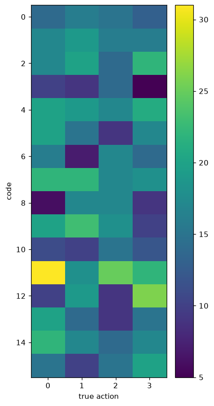

# Results — Stage-0 Synthetic Toy

Procedural sprite toy (one red agent moving L/R/U/D + static distractors), K=16, 5000 steps/run on `bench`. Metrics regenerated from each fetched checkpoint on the held-out val set (seed+1). Six experiments walking the design doc's levers.

## Headline

| Metric (val) | Baseline | +marg+use | +delta | +latent | +latent+VICReg | +delta-code | Target |
|---|---|---|---|---|---|---|---|
| codes / perplexity | 1 / 1.0 | 7 / 5.6 | 10 / 9.1 | 1 / 1.0 | 16 / 15.7 | 16 / 15.6 | non-collapsed |
| encoder `z_std` | — | — | — | 0.007 ⚠ | 1.01 ✓ | 1.02 ✓ | not ~0 |
| no-action gap | 3e-6 | 2e-4 | ~0 | 4.9e-3* | 3.6e-3 | 2.6e-3 | real, > 0 |
| NMI(code, action) | 0.00 | 0.003 | 0.008 | 0.00 | 0.011 | **0.013** | > 0.8 |

*mirage (collapsed target). **The mechanism is now fully healthy — no collapse, full codebook, a real no-action gap — yet NMI stays ~0.01.** Action discovery is not achieved; the obstacle is now purely *semantic*.

## The arc (what each lever fixed)

1. **Codebook collapse** → usage loss (1 → 7 codes).
2. **Action not necessary under pixel/delta MSE** → only the latent target makes it matter (delta pixel prediction did *not* help — hypothesis falsified).
3. **Representation collapse under latent prediction** → VICReg (`z_std` 0.007 → 1.01); first non-degenerate run, real gap, 16/16 codes.
4. **Code might encode absolute state** → fed the inverse model the latent change `Δz = z_{t+1}−z_t` only (`delta_input`). Result: NMI essentially unchanged (0.011 → 0.013).

## Interpretation — the remaining obstacle is semantic, not mechanistic

Every mechanistic failure has been fixed and confirmed: collapse (both kinds), and action necessity. But the codes still carry ~no information about the true L/R/U/D action, even when the code is a pure function of `Δz`. The most likely reason:

> **The encoder's latent space is not position-invariant**, so the latent change `Δz` entangles *where* the agent is with *which direction* it moved. The 16 VQ codes then capture the dominant (position-dependent) variance of `Δz` rather than the four clean directions — so NMI(code, action) ≈ 0 while the code still helps prediction (real gap).

In other words, "the action" is not a clean, low-dimensional, position-invariant quantity in this learned latent space, so a bottlenecked code over `Δz` does not recover it.

**This is now confirmed, not conjectured.** On the delta-code checkpoint, bucketing the agent's position into a 4×4 grid:

> `NMI(code, position-bucket) = 0.064`  vs  `NMI(code, action) = 0.013`

The codes align ~5× more strongly with *where the agent is* than with *which way it moved* (both are low — the codes are diffuse — but position clearly dominates action).

## Where this leaves us (strategic — needs a direction)

The cheap and medium levers from the design doc are now exhausted; the pipeline is healthy but semantically unaligned. Candidate deeper directions, none obviously cheap:

1. **Position-invariant / object-centric structure** so that "moved left" looks the same regardless of where the agent is (the design doc's object-centric route). Given the confirmed position-entanglement, this is the most principled fix — and the biggest change.
2. **Contrastive action loss** on `Δz` — but since `Δz` is position-entangled, contrastive alone likely will not separate directions without (1).
3. **Reconsider the toy or the metric** — a single agent on a plain background makes direction inherently entangled with position in a generic CNN latent; a translation-equivariant encoder, or evaluating against (action × position), may be the more honest framing.

Verdict vs. Stage-0 (NMI > 0.8): **not met after six experiments.** Net result: a clean, evidence-backed map of *why* — collapse and necessity are solved; the open problem is making the action a position-invariant latent quantity. That is a genuine design decision, not another quick knob.
