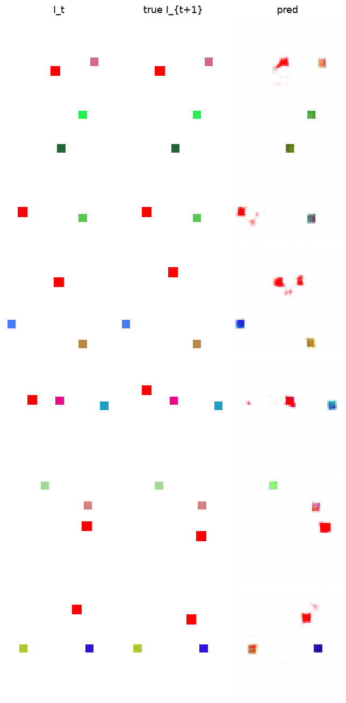

# Results — Stage-0 Synthetic Toy: baseline (prediction + VQ)

**Run:** 5000 steps, default config (`model/minimal` K=16, `loss/baseline` = pixel-prediction + VQ only), on `bench` (alpa12 gpu1), logged live to wandb.
**wandb:** https://wandb.ai/rva_nsr/ssa/runs/jzj52ot1 (project `ssa`).
**Checkpoint:** `model.pt` (fetched). Figures/metrics below regenerated from it on the held-out val set (seed+1).

## Headline

The bare prediction + VQ baseline **does not discover actions**. The codebook collapses to a single code, the codes carry no information about the true action, and the model predicts the next frame just as well *without* the action as with it. This is exactly the failure mode the project's hypothesis anticipated, and it motivates the anti-collapse losses (next cycle).

## Metrics (held-out val)

| Metric | Value | Reading |
|---|---|---|
| NMI(code, true action) | **0.00** | codes carry no action information |
| ARI(code, true action) | **0.00** | same |
| Codebook perplexity | **1.00** (**1 / 16** codes used) | full codebook collapse |
| No-action gap | **3.2e-6** (err w/ action 0.008658 vs w/o 0.008661) | the action is ignored |
| Val pixel MSE | 0.0083 | next-frame prediction is "good" — *without needing the action* |

Success target was NMI > 0.8 and a clear no-action gap; the baseline misses both by design — that is the point of running it.

## Evidence

**Codebook collapse** — one code carries all assignments (perplexity 1.0):

**The action is ignored** — applying every one of the 16 codebook entries to a fixed frame `I_t` yields near-identical predictions (no code produces a distinct transition):

**No code↔action alignment** — all mass sits in a single code row, spread across the true actions:

**Predictions are near-static** — the model reconstructs roughly the current frame as a blurry blob rather than the agent's directional move (predicting "no change" already gets low pixel MSE):

## Interpretation

Two reinforcing shortcuts explain the failure:

1. **The future is largely predictable without the action.** On this toy, `I_{t+1}` is mostly `I_t` (the agent moves one small step; the background and distractors are static). A decoder that predicts ≈`I_t` already attains low pixel MSE, so the dynamics model has little pressure to use the action — hence the ~0 no-action gap.
2. **Nothing prevents VQ collapse.** With only the commitment/codebook loss, the encoder can drive all inputs to one code; that minimizes VQ loss without the codes meaning anything. Perplexity 1.0 confirms it.

So `a_t` is neither *necessary* (the future is predictable without it) nor *used* (the codebook collapsed). Both are unaddressed by the baseline loss.

## Next step

Turn on the two anti-collapse pressures (a `loss/full.yaml` ablation) and re-run:
- **No-action margin loss** — force prediction-with-action to beat prediction-with-zero-action by a margin, making `a_t` necessary.
- **Usage loss** — low per-sample code entropy + high batch-level entropy, breaking the collapse.

Expected on the next run: codebook perplexity rises well above 1, the no-action gap becomes clearly positive, and NMI(code, true action) climbs toward the 0.8 target. The dashboard (this run's wandb panels) is set up to show that contrast directly.
