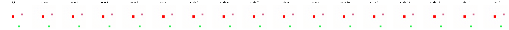

# Results — Stage-0 Synthetic Toy

Procedural sprite toy (one red agent moving L/R/U/D + static distractors), K=16, 5000 steps/run on `bench`. Metrics/figures are regenerated from each fetched checkpoint on the held-out val set (seed+1). Four experiments, walking the design doc's levers.

## Headline

| Metric (val) | Baseline | + margin + usage | + delta | + latent (V-JEPA) | Target |
|---|---|---|---|---|---|
| codes used / perplexity | 1 / 1.00 | 7 / 5.60 | 10 / 9.11 | 1 / 1.00 | non-collapsed |
| NMI(code, action) | 0.00 | 0.003 | 0.008 | 0.00 | > 0.8 |
| no-action gap | 3.2e-6 | 2.1e-4 | 7.6e-7 | 4.9e-3 ⚠ | clearly > 0 |
| encoder `z_std` | — | — | — | **0.0067** ⚠ | not ~0 |
| pred MSE | 0.0083 (px) | 0.0096 (px) | 0.0117 (Δ) | 0.0004 (lat) | — |

**No variant achieves action discovery (NMI stays ~0).** The usage loss reliably breaks *codebook* collapse under pixel/delta prediction, but nothing makes the action necessary or semantic; and the V-JEPA-style latent pivot collapses the *representation*. The Stage-0 success criterion is not met — but the four runs cleanly localize *why*.

## Run-by-run

**Baseline (prediction + VQ).** Total failure as predicted: codebook collapses to 1 code (perplexity 1.0); every code yields an identical prediction (action ignored). The toy's future is ~static, so a blurry near-static prediction is MSE-cheap and the action carries no leverage.

**+ margin + usage.** Usage breaks collapse (7 codes). The no-action gap goes positive but tiny (2e-4), and used codes spread uniformly across actions — no code is action-selective (NMI ~0).

**+ delta prediction.** Predicting `I_{t+1}−I_t` (so the action should explain the *change*) did **not** raise leverage — the gap fell back to ~0 and the counterfactual shows the agent never moving regardless of code. Usage still spreads codes (10), but they remain non-semantic. *Hypothesis falsified.*

**+ latent (V-JEPA).** Predicting the EMA-teacher's latent of `I_{t+1}` (`LatentHead`) instead of pixels — the doc's first recommendation — **collapsed the representation**: `z_std ≈ 0.007` (encoder maps everything to ~a constant). The tiny latent MSE (4e-4) and large-looking gap (4.9e-3) are artifacts of predicting a near-constant target; the codebook re-collapsed to 1 code and NMI is 0. Classic joint-embedding collapse with no anti-collapse term.

## Interpretation

Two distinct failure modes, cleanly separated by the experiments:

1. **Under pixel/delta MSE the action is never *necessary*.** A static/blurry prediction is MSE-optimal under directional uncertainty, so the dynamics ignores `a_t`; the weak (and gameable) no-action margin cannot force it, and delta prediction does not change the calculus. Usage fixes codebook collapse but diverse-yet-ignored codes are not action codes.
2. **Latent prediction removes the blur escape hatch but collapses the representation.** With no variance/decorrelation constraint on the encoder, the joint-embedding objective is trivially solved by a constant embedding (`z_std → 0`).

## Next levers (priority)

1. **Anti-collapse for latent prediction.** Add VICReg-style variance + covariance regularization on the encoder embedding (or a proper asymmetric predictor / tuned EMA) so the representation cannot collapse; *then* latent prediction can be judged fairly. This is the most promising path: it keeps the blur fixed (latent target) while removing the degeneracy that wrecked this run.
2. **Make the action genuinely necessary** — a harder future / low-bandwidth context where a static prediction is bad, plus a non-gameable necessity signal.
3. **Contrastive action loss** — structure the codebook by transition type directly (similar deltas → similar codes), rather than hoping prediction induces it.

Verdict vs. Stage-0 (NMI > 0.8 + clear, real no-action gap): **not met after four experiments.** Confirmed: usage breaks codebook collapse; margin (pixel or delta) does not make the action necessary; naive latent prediction collapses the representation. The evidence points at *latent prediction + an explicit anti-collapse term* as the next experiment.
