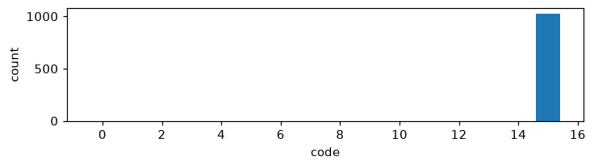
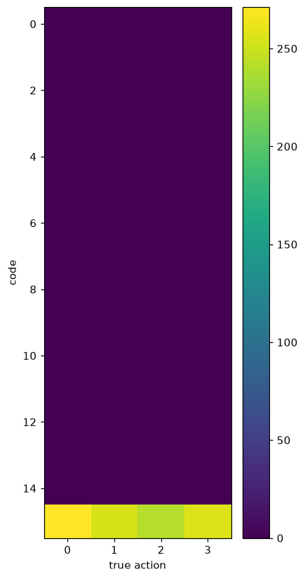
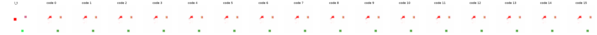

# Exp 0 — Baseline (pixel + VQ)

**Throughline:** _(start)_ → **baseline** → [1 · +margin+usage](../1-full-losses/)

## Reproduce

Trained 5000 steps on `bench`, seed 0, wandb online. Pure defaults:

```bash
uv run python train.py
```

Exact resolved config (concrete, no overrides to reapply): [`config.yaml`](config.yaml).

Config delta from defaults: none. `model=minimal` (encoder → inverse → VQ(16) → dynamics → **PixelDecoder**), `loss=baseline` (prediction + vq, β=0.25), `data=toy` (64², agent step 6, 2 distractors, 8192/1024 train/val), `train=default`. All groups are version-controlled under `config/`. Metrics/figures here were regenerated from the checkpoint on the held-out val set (seed+1).

## Hypothesis

A tight VQ bottleneck trained to predict the next frame will route *some* information about the four hidden actions through its codes. We expect to first **observe the failure modes** — codebook collapse and/or the action being ignored — before adding anti-collapse terms.

## Results

| metric | value |
|---|---|
| NMI(code, action) | 0.00 |
| ARI | 0.00 |
| codes used / perplexity | **1 / 16**, ppl 1.0 |
| no-action gap | 3.2e-6 |
| val MSE | 8.3e-3 |





## Interpretation

Total **codebook collapse**: a single code wins every assignment (perplexity 1.0), so the code carries no information about the action (NMI 0) and applying different codes changes nothing (no-action gap ≈ 0, counterfactual grid is flat). The pixel predictor reconstructs the next frame adequately by ignoring the action entirely. Two coupled failures are visible at once: codebook collapse **and** action-not-necessary.

## Conclusion → next

The bottleneck alone discovers nothing. Two levers to add: the no-action **margin** loss (force a code to change the prediction) and the codebook **usage** entropy loss (force codes to spread). → [Exp 1](../1-full-losses/).
