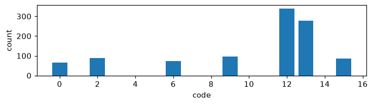
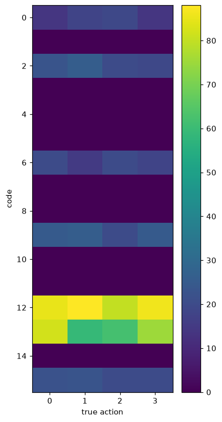
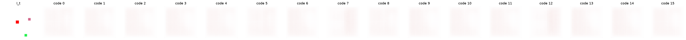

# Exp 1 — +margin +usage (anti-collapse)

**Throughline:** [0 · baseline](../0-baseline/) → **+margin+usage** → [2 · +delta](../2-delta/)

## Reproduce

Trained 5000 steps on `bench`, seed 0, wandb online:

```bash
uv run python train.py loss=full
```

Config delta from [baseline](../0-baseline/): `loss=full` adds two terms — **margin** (no-action counterfactual, m=0.002, weight 1.0) and **usage** (codebook entropy, sample+batch, weight 0.1) — on top of prediction + vq. Same `model=minimal` (PixelDecoder), `data=toy`.

## Hypothesis

The usage entropy loss will break codebook collapse (perplexity ↑), and the no-action margin will force the code to influence the prediction (gap > 0). Both should raise NMI(code, action).

## Results

| metric | value | vs baseline |
|---|---|---|
| NMI(code, action) | 0.0027 | ~0 → ~0 |
| codes used / perplexity | **7 / 16**, ppl 5.60 | 1 → 7 ✓ |
| no-action gap | 2.1e-4 | 3e-6 → real (small) |
| val MSE | 9.6e-3 | — |





## Interpretation

Codebook collapse is **fixed**: 7 codes are now active (perplexity 1.0 → 5.6) and a small but real no-action gap appears. But NMI is still ~0 — the codes are *used*, yet they don't track L/R/U/D. Under pixel MSE the network predicts the next frame well without routing action information through the code, so the codes spend their capacity on something other than the action.

## Conclusion → next

Collapse solved; codes not yet semantic. Working hypothesis: pixel MSE lets the action be ignored because most pixels are predictable from `I_t` alone. Emphasize *what changed* by predicting the **residual** Δ-frame. → [Exp 2](../2-delta/).
