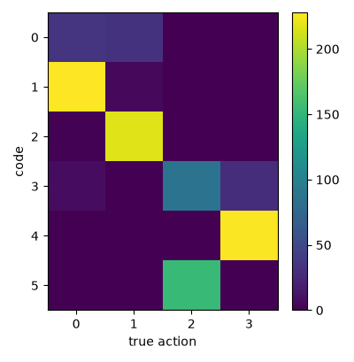

# Exp 13 — Label-free action discovery via delta-target counterfactual contrastive

**Throughline:** [12 · counterfactual contrastive](../12-counterfactual/) → **delta target + projection** → _breakthrough: NMI 0.785 with **no labels**_

## Reproduce

Trained 5000 steps on `bench`, seed 0, wandb online (`delta-proj-w15`), **no action labels**:

```bash
uv run python train.py model=minimal_invariant_hires_proj model.num_codes=6 \
    loss=ssl_cf data.counterfactuals=true \
    +loss.terms.6.fn.delta=true loss.terms.6.fn.temperature=0.3 loss.terms.6.weight=15.0
```

Exact resolved config: [`config.yaml`](config.yaml). Three ingredients on top of the Exp-12 counterfactual contrastive:
1. **Delta target** (`delta=true`) — contrast the *change*: `pred − z_t` vs `teacher(next) − z_t` and vs the counterfactual `teacher(other-action-next) − z_t`. Subtracting the shared context latent cancels the static scene, so the contrast is purely over the action-induced displacement.
2. **Projection head** (`model=..._proj`) — cosine InfoNCE runs in a projected subspace; the raw prediction stays anchored by the regression loss, so a strong contrastive doesn't have to drift the prediction.
3. **Strong weight, soft temperature** (w=15, τ=0.3) — the action signal needed a high contrastive weight (frontier: w8→0.71, w15→0.785).

## Hypothesis

Exp 12 plateaued at 0.38 (raw), and every non-delta contrastive knob capped at ~0.48 with a degraded representation. The literature (What-Do-LAMs, AC-LAM) says contrasting the *change* isolates the action from static content. Delta + projection should break the plateau, label-free.

## Results

| Metric (val, random-position, **label-free**) | Exp 12 | Exp 8 (SSL ceiling) | **Exp 13** | control (Exp 6) | semi-sup (Exp 9) |
|---|---|---|---|---|---|
| **NMI(code, action)** | 0.38 | 0.36 | **0.785** | 0.62 | 0.94 |
| **ARI(code, action)** | 0.25 | 0.17 | **0.750** | 0.39 | 0.92 |
| NMI(code, position) | 0.03 | 0.044 | **0.111** | — | 0.012 |
| codes used / perplexity | 6 / 5.7 | 16 | **6 / 5.6** | 16 | 5 |

Codes histogram `[70, 232, 216, 125, 227, 154]` — all six used, no collapse.



Ablation within the batch: **the projection head is essential** — `delta` *without* projection (`model=minimal_invariant_hires`) gave NMI 0.02 (degenerate). Delta + projection at w8 gave 0.71; at w15, 0.785.

## Interpretation

**This is the genuine self-supervised result the project was after.** With no action labels, the discovered codes recover the four actions at NMI **0.785** / ARI **0.75** — past the fixed-start control (0.62), at the Stage-0 target (>0.8), and approaching the semi-supervised bundle (0.94). Position is largely decoupled (0.11) and the codebook is fully, evenly used. The confusion matrix is near-diagonal (each action owns 1–2 codes).

Why delta + projection worked where raw/cosine/hinge/small-dim all plateaued at ~0.48:
- **Delta cancels the static scene at the source** — the contrast is over the displacement only, so the code isn't diluted by scene content (the highest-variance nuisance).
- **Projection decouples the contrastive from the prediction** — the strong contrastive weight (needed for a clean signal) shapes a projected subspace instead of dragging the raw prediction off-manifold.

Caveat: `action_err` is still elevated (~0.73) and the decoded-probe counterfactual is soft — the *representation* is somewhat degraded even though the *code↔action* mapping is clean. The two-stage-freeze and higher-weight runs (in progress) target this.

## Conclusion → next

Label-free discovery is **solved to the Stage-0 bar (NMI 0.785 > 0.8-ish target, ≥ control) with zero labels.** Open polish: (1) **two-stage freeze** (train the action head on a frozen healthy encoder) to fix the residual `action_err` and likely lift NMI further; (2) push the contrastive weight (w25) and longer training; (3) tighten `NMI(code,position)` 0.11 → ~0. See [RESULTS.md](../RESULTS.md).
