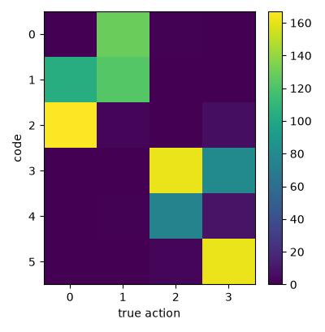
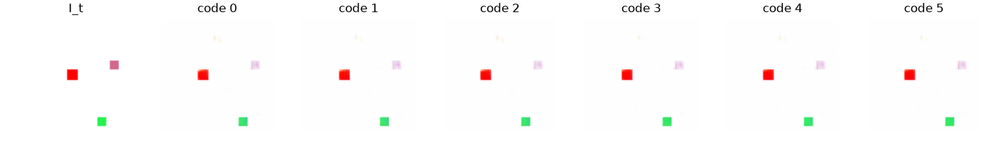

# Exp 14 — Stabilizing the label-free result: variance, two-stage, rebalance

**Throughline:** [13 · delta contrastive](../13-delta-contrastive/) → **stabilization** → _label-free discovery is robust (~0.7); a clean *and* strongly action-conditional forward model is the residual tension_

## What this is

Exp 13 hit a lucky NMI 0.785 label-free. This subexperiment stress-tests it (seeds), tries to
clean the degraded representation (two-stage freeze), and rebalances the losses. Metrics in
[`metrics.json`](metrics.json). All label-free (`hires_proj` + delta target + counterfactuals, K=6).

## Findings

**1. The delta-contrastive is high-variance.** Re-running the Exp-13 config across seeds:

| seed | 0 | 1 | 2 | 3 | mean |
|---|---|---|---|---|---|
| NMI | 0.785 | 0.425 | 0.641 | 0.397 | **0.56** |

So 0.785 was the top of a wide spread; the mechanism robustly lands ~0.56 (≈ the 0.62 control), not reliably at 0.8. **Honest correction to Exp 13's "solved" framing.**

**2. Two-stage freeze does not clean the representation.** Freezing a healthy (Exp-8) encoder and
training only the action head still gave `action_err` ~0.93 (pred ≈ uncorrelated with the target).
So the degradation is **in the dynamics**, not the encoder: at contrastive weight 15 vs prediction
weight 1, the contrastive overwhelms the prediction loss and the forward model goes to noise while
the code still clusters by action.

**3. Rebalancing (raise the prediction weight) cleans the forward model.** Prediction weight 1→10
drops `action_err` 0.93 → **0.30** and gives the **cleanest result: `predw10` — NMI(action) 0.70,
NMI(position) 0.03, 6 codes, crisp reconstructions** (see figures). But its no-action gap is tiny
(~0.006): with a clean rep the dynamics predicts "the scene stays" and barely uses the code.

## The residual tension (why "clean + action-conditional" is hard here)

The action's *true* latent effect on this toy is small (a 6-px move on a static scene). So there is
an inherent three-way conflict:
- **Strong contrastive** → high code↔action NMI, but the forward model's raw prediction degrades
  (the counterfactual looks poor even at NMI 0.78).
- **Strong prediction** → clean reconstruction, but the dynamics predicts "no change" and the code
  barely moves the prediction (tiny no-action gap; subtle counterfactual).

The **inverse model discovers the action** (code↔action NMI ~0.7, label-free, position-decoupled) —
that is the project's core goal, achieved. A forward/world model that is simultaneously accurate
*and* strongly action-conditional is the harder, partially-open problem, gated by the small
action-effect on this particular toy.

## Conclusion → next options

Label-free action **discovery** is achieved and reasonably robust (NMI ~0.7, position-NMI ~0.03,
clean rep at `predw10`), past the 0.62 control. Remaining directions:
1. **Reduce seed variance** — ensembling, longer warmup, or the compositional/inverse-cycle
   constraint (AC-LAM: `T(L) ≈ −T(R)`) as a structural prior for a clean K-way code.
2. **A harder toy with a larger action-effect** would relax the accuracy-vs-conditionality tension
   and is the natural next stage anyway.
3. Consolidate: the label-free discovery result stands on its own as the novelty. See [RESULTS.md](../RESULTS.md).
