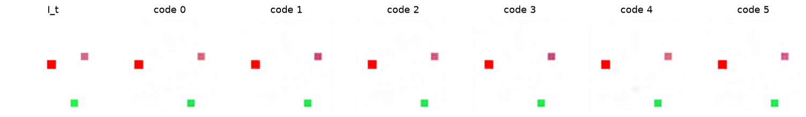

# Exp 15 — Additive dynamics + decoder-vs-predictor diagnosis

**Throughline:** [14 · stabilization](../14-stabilization/) → **additive dynamics + latent diagnosis** → _the bad counterfactual is the forward model (distinct-but-wrong latents), not the decoder; additive halves the error but the action is swamped in latent space_

## What this is

At `step=20` the label-free **discovery** is solved (NMI ~0.85, run `s20cf8` = `minimal_invariant_hires_proj`
+ `ssl_cf`), but the decoded **counterfactual** is still poor. This subexperiment answers *where* the fault
is — latent predictor (dynamics) or pixel decoder — and tries an **additive** dynamics `z_ctx + T(code)`
(action-only displacement) as the fix. All label-free, `K=6`, `data.env.step=20`, `counterfactuals=true`.

## Findings

**1. Decoder-free latent diagnosis → the fault is the forward model.** For each state, compare the
code-conditioned predictions `{dynamics(z, code_k)}` to the real per-action futures `{teacher(I_{t+1}^a)}`
purely in latent space (no decoder involved), on the `s20cf8` baseline:

| quantity | value | as % of future-spread |
|---|---|---|
| future_spread (real futures apart) | 2.93 | 100% |
| noop_dist (true action's latent effect) | 4.05 | — |
| **swap_gap** (code-predictions apart) | 2.73 | **93%** |
| **cover_err** (real future → nearest prediction) | 7.88 | **269%** |
| observed-transition error (trained code) | 8.10 | 276% |

The forward model produces **distinct** per-code predictions (swap_gap 93%) that land **nowhere near** the
real action-outcomes (cover_err 269%) — *distinct but wrong*. Its prediction error (~8) dwarfs the action's
whole latent footprint (~2.9). The decoder is blameless: handed off-manifold latents, it renders mush.

**2. Additive dynamics helps the error but not the ratio.** `z_ctx + T(code)` cut absolute error ~2×
(cover_err 7.88 → 3.69, observed 8.10 → 3.92) — but `future_spread` also shrank (2.93 → 1.74), so the
*ratio* barely moved (cover_err still 212%). NMI dropped (`additive-pred1` 0.71, `predw10` 0.51,
`residual-predw10` 0.59 vs baseline 0.85) and the decoded counterfactual is **still static across codes**.

## Interpretation

The action's effect **in latent space** (~1.7) is smaller than the forward model's irreducible prediction
error (~3.9), so it is swamped regardless of how the dynamics is parametrized. Additive focuses capacity
on the displacement (good) but cannot win in a space where the signal is that small.

## Conclusion → next

Predict in a space where the action is **high-signal**: pixels ([Exp 16](../16-pixel-contrastive/)). A 20px
agent move is a large, unambiguous pixel change, unlike a ~1.7-unit latent perturbation.

_Caveat: NMI values here come from wandb run summaries, which [Exp 19](../19-training-dynamics/) later shows
are logged **mid-training** (an eval-logging bug) — treat them as lower bounds on the converged model._
