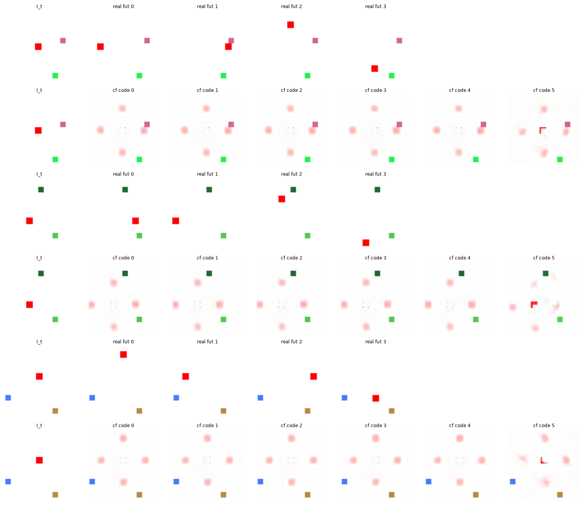
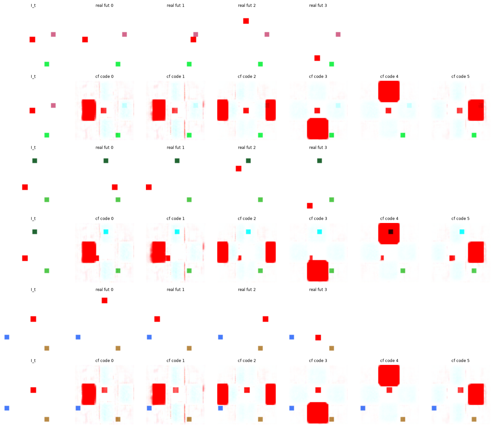

# Exp 16 — Pixel-space same-state contrastive (the breakthrough)

**Throughline:** [15 · additive dynamics](../15-additive-dynamics/) → **pixel-delta head + same-state contrastive in pixel space** → _first action-conditional counterfactual: NMI 0.82 with distinct, directionally-correct per-code moves_

## What this is

Move the prediction (and the contrastive) into **pixel space**, where the action is high-signal. Head =
`PixelDecoder(delta=True)` (predicts the frame change `Δ = I_{t+1}-I_t`), dynamics additive, inverse the
position-invariant one. Three losses compared, all label-free, `K=6`, `step=20`, `counterfactuals=true`.

## Findings

**1. Pixel MSE alone collapses to the mean** (`loss=pixel`, prediction only). NMI **0.004**, all 6 codes
used but the counterfactual is a symmetric **4-way blur** — the agent smeared over all destinations,
identical across codes. The action is a small, low-variance part of the image, so MSE is minimized by
predicting the average and ignoring the code.

**2. Pixel-space same-state contrastive breaks the symmetry** (`loss=pixel_cf`). InfoNCE in pixel space:
the predicted `Δ` must be closer to the observed next-frame than to the same-state counterfactual frames
(negative-MSE similarity, `τ=0.03`). NMI **0.819**; the counterfactual now shows **distinct directional
moves**, verified consistent across 200 states:

| code | 0 | 1 | 2 | 3 | 4 | 5 |
|---|---|---|---|---|---|---|
| predicted move | L 96% | L 99% | mixed | D 100% | U 99% | R 98% |

**3. Sinkhorn coverage does NOT break the symmetry** (`loss=pixel_cov`, `losses/sinkhorn_coverage.py`).
Forcing `{dynamics(z, code_k)}` to cover the real futures via a differentiable optimal-transport assignment
gave NMI **0.005** — from a symmetric (mean) start the transport plan is uniform, so there is no
symmetry-breaking gradient, and coverage never trains the *inverse* discriminatively.

## Interpretation

The **contrastive is load-bearing**: it is the only mechanism that forces the code to be discriminative
(breaks the mean-seeking fixed point). It works in pixel space because the outcome difference between
actions is large and unambiguous there, unlike the swamped latent signal of [Exp 15](../15-additive-dynamics/).
The agent is still rendered **blobby** (coarse decoder), and the code↔direction map has redundancy (two
codes → left) — cleaned up in [Exp 17](../17-all-action-supervision/).

## Conclusion → next

Add per-code **frame targets** so each code renders its action's *correct* move, not just a distinct one:
combine the contrastive with all-action direct supervision ([Exp 17](../17-all-action-supervision/)).
