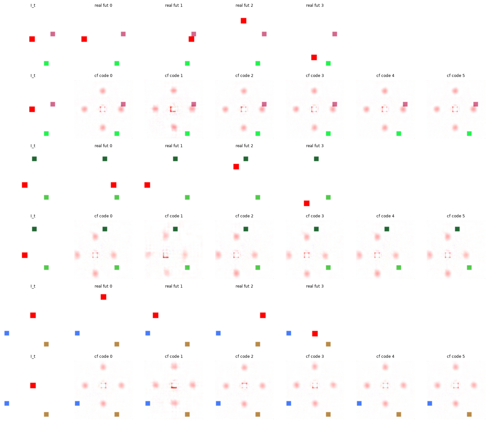
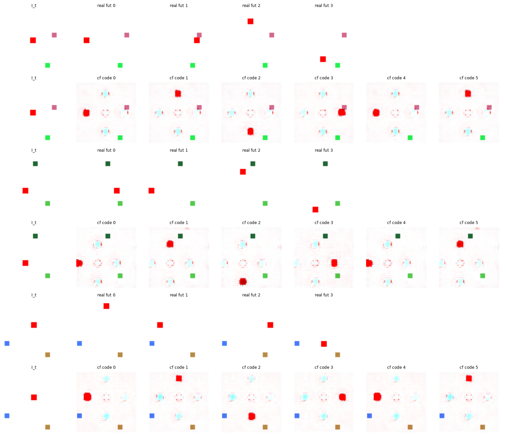

# Exp 17 — All-action supervision (clean, distinct, correct counterfactuals)

**Throughline:** [16 · pixel contrastive](../16-pixel-contrastive/) → **+ all-action direct supervision** → _best result: NMI 0.89–0.95 with distinct, directionally-correct per-code moves (100% consistent)_

## What this is

The contrastive discriminates but only *shapes* the code; the counterfactual for non-observed codes has no
target. **All-action supervision** (`losses/all_action_prediction.py`) uses the same-state counterfactual
frames as *supervision*: for every real future, infer its code and regress `dynamics(z, code)` onto that
future's real frame-change. Label-free (no action labels; only that these frames share a state). Pixel-delta
head, `K=6`, `step=20`, `counterfactuals=true`.

## Findings

**1. All-action MSE *alone* also collapses to the mean** (`loss=pixel_allact`). NMI **0.005** — same
low-variance-action failure as pixel MSE: predicting the mean over the 4 futures is a low-MSE optimum, so
the inverse never has to discriminate.

**2. Contrastive + all-action = the clean result** (`loss=pixel_cf_allact`). The contrastive breaks the
symmetry (forces distinct codes); all-action gives each discovered code its action's real frame target.
NMI **0.892** (all 6 codes), and every code maps to a **single, 100%-consistent** direction across 200
states — covering all four actions (with redundancy, expected for 6 codes / 4 actions):

| code | 0 | 1 | 2 | 3 | 4 | 5 |
|---|---|---|---|---|---|---|
| predicted move | L | U | D | R | L | U |

The decoded counterfactual shows a crisp-ish red agent moved to the correct distinct position per code:

A longer, logging-fixed rerun (`32-pixel-clean-fixed`, 8000 steps) reached NMI **0.911**.

## Interpretation

The two mechanisms are complementary and *both* required: **contrastive → discrimination** (which code),
**all-action → per-code correctness** (what that code renders). Neither alone works (Exp 16 #1/#3, Exp 17 #1).
This is the first configuration that delivers label-free discovery **and** a faithful action-conditional
counterfactual. Remaining defect: faint background artifacts + a slightly soft agent (cosmetic, [Exp 18](../18-counterfactual-fidelity/)).

## Conclusion → next

Discovery + action-conditional counterfactual is **solved** here (NMI ~0.9, distinct correct moves). Two
follow-ups: clean the render artifacts ([Exp 18](../18-counterfactual-fidelity/)) and understand/stabilize
the sharp, seed-dependent training transition ([Exp 19](../19-training-dynamics/)).
