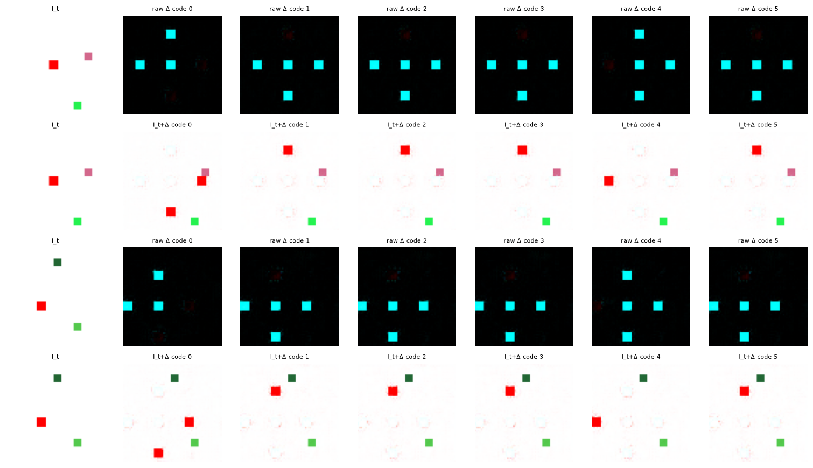
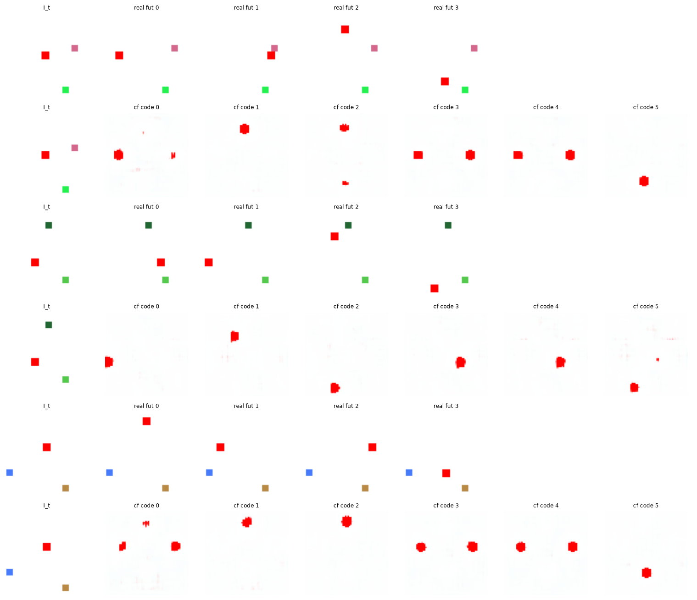

# Exp 18 — Counterfactual fidelity (killing the render artifacts)

**Throughline:** [17 · all-action supervision](../17-all-action-supervision/) → **finer decoder + sparsity / full-frame / compositing** → _cosmetic cleanup; the delta/L1 knob trades one artifact for another, compositing is the structural fix_

## What this is

The Exp-17 counterfactual is correct but has **faint cyan "ghost" squares** and a soft agent. This
subexperiment attacks render fidelity (not discovery). Base: pixel-delta head + `pixel_cf_allact`.

**Why the cyan:** the delta head outputs `Δ = I_{t+1}-I_t`. Where the agent *leaves*,
`Δ = white - red = [0,1,1] = cyan`; where it *arrives*, `Δ` is negative and clamps to black. So the raw
`Δ` looks like cyan ghosts — you must add `I_t` to see the actual frame.

## Findings

**1. Finer decoder (`start=8`) + L1 delta-sparsity (`loss=pixel_clean`).** Sharper agent, cyan much
reduced, NMI **0.945** (best) — but faint ghosts remain and the static distractors render washed-out.

**2. The L1 sparsity is a knife-edge.** On `mean|Δ|`:

| L1 weight | effect | NMI |
|---|---|---|
| 1.0 | crisp agent, faint ghosts | 0.945 |
| 2.5 | cyan gone, but old position not erased → **agent duplicates**; blobby | 0.775 |
| 5.0 | erases the move entirely → **collapse** | 0.006 |

L1 cannot distinguish "spurious low-amplitude change" from "needed agent move" by magnitude alone.

**3. Full-frame head removes cyan but drops the distractors.** `delta=false` (predict `I_{t+1}` directly)
→ no `I_t+Δ` residual, clean background — but the decoder **stops rendering the static distractors** (they
are low-MSE, so it doesn't bother). NMI **0.634**.

**4. Compositing head is the structural fix.** `CompositePixelDecoder`: `pred = α·F + (1-α)·I_t` copies the
scene verbatim from `I_t` and writes only where the mask `α` is high (the agent), with `L_α = mean(α)` to
keep it localized. This cannot produce cyan ghosts *or* drop distractors by construction. Implemented
(`models/heads.py`, `losses/alpha_sparsity.py`, `config/model/minimal_invariant_composite.yaml`,
`config/loss/composite.yaml`) but not yet run at length.

## Interpretation / conclusion

Fidelity is a **decoder-structure** problem, orthogonal to discovery — the delta head's erase-vs-paint
tension can't be tuned away with L1, and the full-frame head loses the scene. The compositing head is the
principled fix and the natural next run. This is polish, not the bottleneck.
