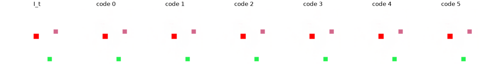
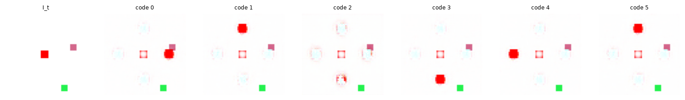
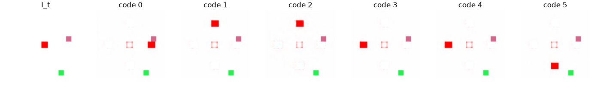

# Exp 19 — Training dynamics: the eval-logging bug and the phase transition

**Throughline:** [18 · counterfactual fidelity](../18-counterfactual-fidelity/) → **diagnose the atypical loss curves** → _a logging bug hid the result; learning is a sharp, seed-dependent VQ phase transition (grokking)_

## What this is

Two coupled discoveries about *how* these runs train. Not a new mechanism — a methodological correction and
a characterization. See [`docs/pipeline-and-losses.md`](../../../../docs/pipeline-and-losses.md) §6 for the full analysis.

## Findings

**1. Eval-logging bug — every wandb figure was mid-training.** `Trainer.fit` fired the periodic eval on
`step % eval_every == 0` *before* incrementing `step`, and the loop exits at `step == max_steps` via `break`
— so the **final-step eval never ran**. For a 6000-step / eval-every-2000 run, only steps **2000 and 4000**
were logged. Since the model learns *late* (below), those logged figures show a still-static model, so every
run **looked broken on wandb** even when the final checkpoint had learned. Logged scalars (NMI etc.) were
likewise mid-training values.

Fixed in `Trainer.fit`: a final eval now always runs. Verified — run `32-pixel-clean-fixed` logs steps
2000/4000/6000/8000 and the final-step grid shows the moves:

**2. Learning is a sharp phase transition (grokking + VQ reorganization).** NMI: `0.003 @ 2000`,
`0.003 @ 4000`, then `0.9 @ 6000`. The contrastive accuracy (train-side, every 20 steps) sits at **chance
(0.25) for ~5000 steps, then snaps to 1.0 in ~200 steps.** The transition burst:

| step | total loss | vq loss | grad_norm | cf_acc |
|---|---|---|---|---|
| 5000–5180 | ~5.44 (flat) | ~0.004 | ~0.3 | ~0.25 (chance) |
| 5240 | **7.62** | **2.71** | **10.1** | 0.55 |
| 5300 | 5.87 | 1.40 | 7.4 | 0.73 |
| 5360 | 3.89 | 0.31 | 0.6 | **1.00** |
| 5400 → end | **3.44 (flat)** | ~0.01 | ~0.6 | 1.00 |

Only **3 steps in the whole run** have `grad_norm > 3` — all inside this window. The total loss settles
**below** the plateau (5.44 → 3.44): a strictly better optimum.

## Interpretation

The VQ `argmin` is piecewise-constant, so there's no gradient through the code choice; the model sits on a
plateau predicting the **mean** (blur) while the continuous `a_pre` slowly drifts. Once `a_pre` for distinct
actions cross into distinct Voronoi cells, the steep InfoNCE (`τ=0.03`) gets sudden traction (positive
feedback), the **codebook reassigns** (→ the `vq`/`grad` spike), and it locks onto the action clusters. This
is grokking + a codebook reorganization — the loss "spikes" you see are **benign** (they resolve lower).

The real weakness is **fragility**: the transition step is seed-dependent (observed ~2000 / ~4500 / ~5300),
so a short budget looks like total failure and seeds vary in final NMI.

## Conclusion → next

Stabilize/accelerate the transition (the genuine remaining problem): **EMA codebook** updates, **contrastive
temperature annealing**, **LR/codebook warmup**, dead-code resets. See `docs/pipeline-and-losses.md` §8.
