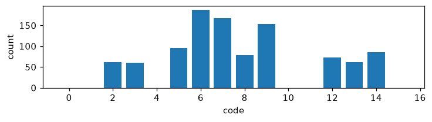
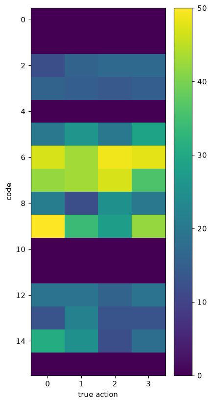

# Exp 2 — Delta (residual) pixel prediction

**Throughline:** [1 · +margin+usage](../1-full-losses/) → **+delta** → [3 · +latent](../3-latent/)

## Reproduce

Trained 5000 steps on `bench`, seed 0, wandb online:

```bash
uv run python train.py loss=full +model.head.delta=true
```

Config delta from [Exp 1](../1-full-losses/): `+model.head.delta=true` switches the PixelDecoder to **residual** mode — it predicts `I_{t+1} − I_t` (tanh output), and the target becomes the frame delta. Same `loss=full`, `model=minimal`.

## Hypothesis

Predicting only the *change* (the moving agent) rather than the full frame should make the action necessary — the residual is dominated by the agent's motion, which is exactly what the action controls — so NMI should rise.

## Results

| metric | value | vs Exp 1 |
|---|---|---|
| NMI(code, action) | 0.0081 | ~0 → ~0 |
| codes used / perplexity | **10 / 16**, ppl 9.11 | 7 → 10 |
| no-action gap | **7.6e-7** (≈0) | collapsed |
| delta MSE | 1.17e-2 | — |





## Interpretation

Codebook spread improved further (10 codes), but the no-action gap **collapsed to ≈0** and NMI stayed ~0.01. The hypothesis is **falsified**: predicting the delta did not make the action necessary. Even the residual frame is largely predictable from `I_t` (the agent's current location plus a small blur), so the model still ignores the code. Pixel/delta MSE is the wrong target — it rewards blurry averaging over committing to a discrete action.

## Conclusion → next

Pixel-space targets let the action be ignored. Switch to a **latent** prediction target (V-JEPA-style: predict an EMA-teacher's encoding of `I_{t+1}`), which has no pixel-MSE blur escape hatch. → [Exp 3](../3-latent/).
