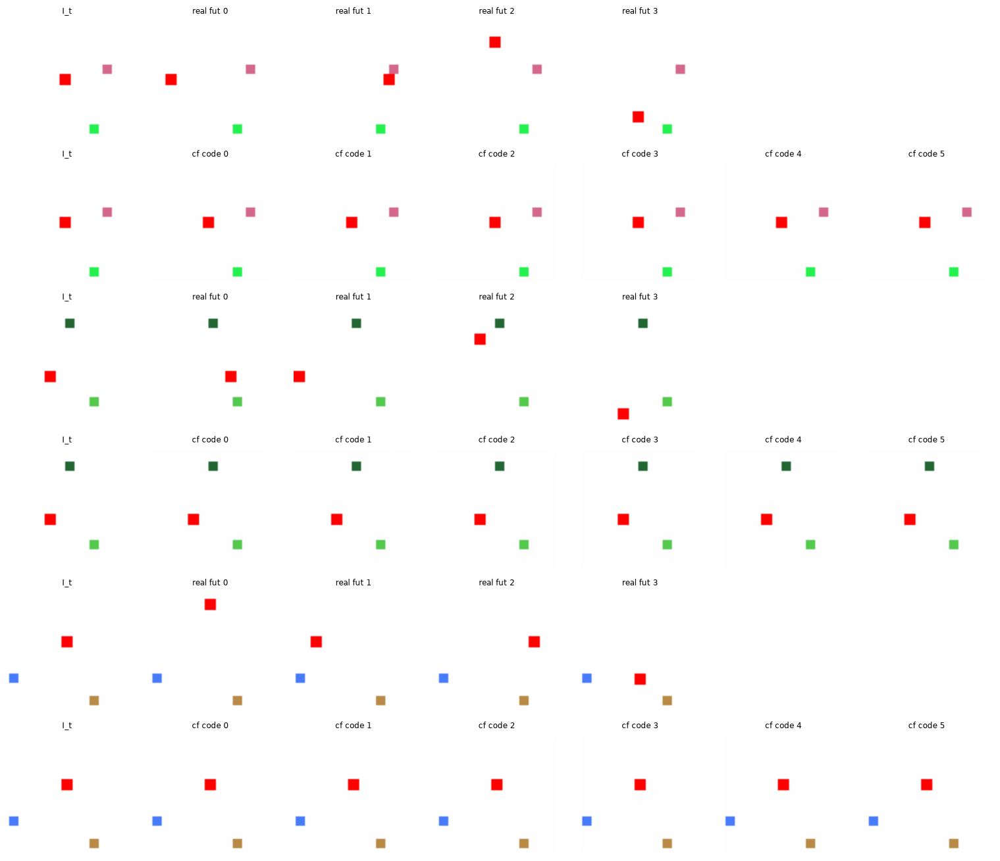
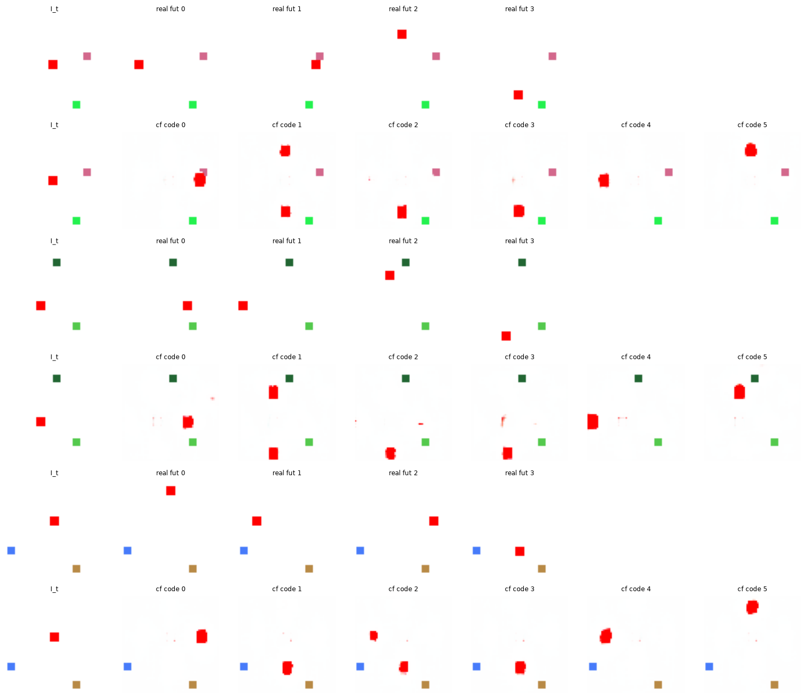

# Exp 22 — Compositing head (clean render vs discovery, a tension)

**Throughline:** [18 · counterfactual fidelity](../18-counterfactual-fidelity/) → **compositing head `α·F + (1−α)·I_t`** → _removes the cyan ghosts, but the easy copy-`I_t` path collapses discovery unless α-sparsity is tuned; salvaged at α-sparsity 0.1 (NMI 0.77, distinct moves, no cyan) — still below the delta head's 0.89._

## What this is

Subexp 18 proposed a compositing head as the structural fix for the delta head's cyan ghosts: predict a
frame `F` and a soft mask `α`, output `α·F + (1−α)·I_t` — copy the static scene from `I_t`, write only the
moved agent. `AlphaSparsityLoss` keeps α localized. Tested with `loss=composite`, `step=20`, `K=6`.

## Findings

**1. A real bug, fixed.** The first runs crashed (exit 1): `CompositePixelDecoder` is not a `PixelDecoder`
subclass, so `cf_contrastive` fell into the latent branch and tried to `cat` a 5-D frame with 3-D teacher
latents. Fixed by routing any head with a `.delta` attribute to the pixel-space contrastive.

**2. α-sparsity too high collapses discovery.** At the default `α-sparsity=0.5`, NMI **0.003** — the head
learns `α→0` (copy `I_t`) and ignores the action. The counterfactual is pristine but **identical to `I_t`
for every code** (the agent never moves): copying the input is an easy low-loss path for a low-variance
action, and the sparsity penalty reinforces it.

**3. Lowering α-sparsity salvages it.** Sweep: `0.5 → 0.003`, `0.1 → 0.774`, `0.0 → 0.672`. At **α-sparsity
0.1** the counterfactual shows **distinct, directionally-correct per-code moves with no cyan ghosts** and
mostly-preserved distractors (code 0→R, 1→U, 2/3→D, 4→L, 5→U, consistent across states).

## Interpretation / conclusion

| head | NMI | render |
|---|---|---|
| delta (subexp 17) | **0.89–0.95** | distinct correct moves, faint **cyan ghosts** |
| composite (α-sparsity 0.1) | 0.774 | distinct correct moves, **no cyan**, distractors mostly kept |

The compositing head removes the cyan (cleaner background) but costs ~0.12 NMI and adds a discovery-vs-
fidelity tuning tension (the copy-`I_t` trap). The **delta head remains the higher-NMI result**. Crucially,
**both leave the agent a blurry blob** — that shared fidelity ceiling is the coarse decoder (upsampling from
an 8×8 bottleneck), not the head choice. If a genuinely crisp counterfactual is needed, the lever is a
finer/higher-capacity decoder, not compositing. Given the core result (label-free discovery + distinct,
directionally-correct counterfactuals) is solid via the delta head, this is polish — the next frontier is a
harder toy with a larger action-effect.
