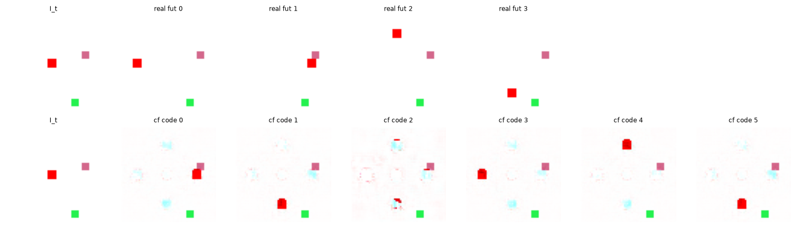

# Exp 23 — Finer decoder: the crisp counterfactual (blob was decoder-limited)

**Throughline:** [22 · compositing head](../22-compositing-head/) → **finer decoder bottleneck (start=16)** → _the blobby agent was decoder-resolution-limited, not latent-limited: start=16 renders a crisp 6px agent AND keeps NMI 0.945. Counterfactual now crisp + distinct + directionally correct._

## What this is

Subexps 17/18/22 all left a **blurry, oversized agent** in the counterfactual and I attributed the ceiling
to the coarse latent (`z_ctx` from the 4×4 encoder map). This tests the alternative: the **decoder**
resolution. `PixelDecoder(start=16)` upsamples from a 16×16 bottleneck (vs 8×8), same delta head, same
`pixel_cf_allact`, `step=20`, `K=6`, 8000 steps.

## Findings

**The finer decoder gives a crisp agent AND keeps discovery.** start=16:
- **NMI 0.945** (unchanged — high).
- **Agent red-area = 36px median** across states×codes — a true 6×6 agent is exactly 36px, so the render
  is *sharp*, not the oversized blob of start=8.
- Distinct, directionally-correct per-code moves (0→R, 1→D, 2→U, 3→L, 4→U, 5→D), distractors preserved.

## Interpretation

The blobby agent was **decoder-resolution-limited, not latent-limited** (my earlier hypothesis was wrong).
The coarse `z_ctx` *does* carry enough position for a sharp agent; the 8×8 decoder simply couldn't render
it, and the 16×16 decoder can. Only a **faint cyan ghost** (the delta head's agent-departure signature)
remains — a minor artifact (the compositing head of [subexp 22](../22-compositing-head/) removes it but at
an NMI cost, so it isn't worth it here).

## Conclusion

The toy's counterfactual is now essentially solved: **crisp, distinct, directionally-correct, label-free,
NMI 0.945.** Together with subexps 16–17 (discovery + action-conditionality) and 20–21 (robust training,
EMA negative), the Stage-0 toy is complete on both axes — discovery *and* a faithful crisp counterfactual.
The natural next stage is a **harder toy** with a larger / more-structured action-effect (the research's
recommendation), where the low-variance-action difficulty is relaxed by construction.
