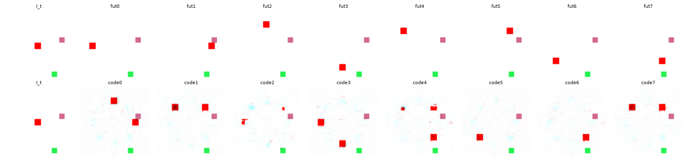

# Exp 24 — Harder toy: 8 actions (partial scaling)

**Throughline:** [23 · finer decoder](../23-finer-decoder/) → **8-action toy (cardinals + diagonals)** → _the pipeline scales to a larger action space with graceful partial discovery: NMI ~0.62 (vs 0.9 for 4 actions), all 8 codes used, render stays crisp; some codes conflate 2 actions._

## What this is

The 4-action Stage-0 toy is solved (discovery + crisp counterfactual). First harder-toy step: **8 actions**
= 4 cardinals + 4 diagonals (at ~equal magnitude, `d = step/√2`), a larger discrete action space that
stresses the bottleneck and the 8-way counterfactual. Same pipeline (pixel-delta head, `start=16`,
`pixel_cf_allact`), `K=8`, `step=20`, 10000 steps, 3 seeds.

## Findings

**Partial scaling.** NMI **0.621 mean** (0.537 / 0.712 / 0.615 across seeds), ARI 0.318, **8/8 codes used**,
agent render **crisp** (38px median, vs 36 for a true agent). Well above chance, but degraded from the
4-action ~0.9.

The render fidelity holds (crisp agents), but **several code panels show the agent in two positions** (e.g.,
codes 0/1/4/7) — those codes conflate two of the eight actions. The clean 4-way separation doesn't fully
extend to 8-way at `K=8`.

## Interpretation

The method **generalizes to a larger action space** — it uses all codes, keeps a crisp render, and finds a
substantial (NMI 0.62) code↔action mapping — but the finer 8-way distinctions (diagonals sit "between"
cardinals in the feature-difference signature) aren't cleanly separated when `K=8` gives no code slack
(recall 4 actions worked best at `K=6`, i.e. 1.5× slack). Discovery degrades gracefully with action-space
size rather than collapsing.

## Conclusion → next

Partial scaling to 8 actions demonstrated (crisp render, NMI ~0.62). Natural levers to close the gap:
**more codes** (`K=12–16` for slack, the lever that helped at 4 actions), longer training, or finer feature
resolution so diagonals are distinguishable. Broader harder-toy directions (temporally-extended / momentum
actions, multi-object interactions) remain open for the next phase.

## Update — K=12 (code slack) scales it

Re-running with **K=12** (slack, like the 1.5× that helped at 4 actions): NMI **0.788 mean** (0.637 / 0.816 / **0.912**), ARI up to 0.46, crisp render. Code slack largely closes the 8-action gap — the best seed (0.91) essentially discovers all 8 actions. So the method **scales to a larger action space given enough codes**; K=8 (exact) was just too tight.
