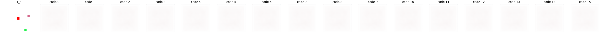

# Exp 3 — Latent prediction (V-JEPA-style)

**Throughline:** [2 · +delta](../2-delta/) → **+latent** → [4 · +VICReg](../4-vicreg/)

## Reproduce

Trained 5000 steps on `bench`, seed 0, wandb online:

```bash
uv run python train.py model=minimal_latent loss=full
```

Exact resolved config (concrete, no overrides to reapply): [`config.yaml`](config.yaml).

Config delta from [Exp 2](../2-delta/): `model=minimal_latent` swaps the PixelDecoder for a **LatentHead** that predicts the EMA-teacher's latent encoding of `I_{t+1}` (teacher momentum 0.99); the residual-pixel head is gone. `loss=full` kept.

## Hypothesis

A latent target removes the pixel-MSE blur escape hatch, so the model must route information through the action code to predict the next latent. NMI should finally rise and the no-action gap become real.

## Results

| metric | value |
|---|---|
| **encoder z_std** | **0.0067 ⚠ (≈0)** |
| NMI(code, action) | 0.00 |
| codes used / perplexity | 1 / 16, ppl 1.0 |
| latent MSE | 4.0e-4 (trivially low) |
| no-action gap | 4.9e-3 *(mirage)* |




## Interpretation

A new, worse failure: **representational collapse**. The encoder and its EMA teacher co-collapse to a near-constant embedding (`z_std` ≈ 0), so predicting the next latent is trivial (latent MSE ≈ 0) and the apparent no-action gap is a **mirage** — any prediction is near-zero error. With a constant representation, all transitions look identical, so the codebook collapses back to 1 code. The latent target is right in principle but unconstrained: nothing stops the trivial constant solution.

The **decoded counterfactual** (decoder probe trained on the frozen encoder; rerun `proud-gorge-7`) makes the collapse visible: the agent disappears and all 16 codes decode to the same washed-out, near-blank frame. There is nothing for the probe to reconstruct — the encoder maps every frame to ~the same vector — so applying different codes changes nothing in pixel space.

## Conclusion → next

Need an explicit anti-collapse constraint on the *representation* itself. Add **VICReg** (variance hinge + covariance decorrelation) on the encoder embedding. → [Exp 4](../4-vicreg/).
