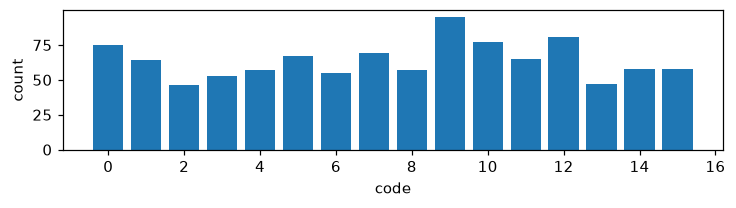
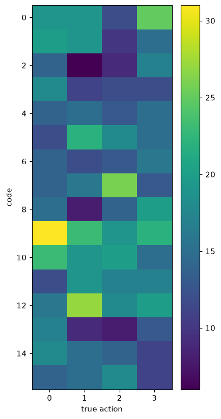

# Exp 4 — Latent + VICReg (anti-collapse)

**Throughline:** [3 · +latent](../3-latent/) → **+VICReg** → [5 · +delta-code](../5-delta-code/)

## Reproduce

Trained 5000 steps on `bench`, seed 0, wandb online:

```bash
uv run python train.py model=minimal_latent loss=vicreg
```

Config delta from [Exp 3](../3-latent/): `loss=vicreg` adds a **VICRegLoss** on the encoder embedding (var_weight 25, cov_weight 1, γ 1) — a variance hinge that keeps each dimension's std near 1 plus covariance decorrelation — on top of full losses + the latent head.

## Hypothesis

The VICReg variance term will prevent the encoder from collapsing (`z_std` → ~1), restoring a non-degenerate latent in which the action-prediction objective can finally make the code matter. Expect the first *healthy* run, with NMI ↑.

## Results

| metric | value | vs Exp 3 |
|---|---|---|
| **encoder z_std** | **1.012 ✓** | 0.0067 → ~1 |
| codes used / perplexity | **16 / 16**, ppl 15.70 | 1 → 16 |
| no-action gap | 3.6e-3 (real) | mirage → real |
| NMI(code, action) | 0.0115 | ~0 → ~0 |
| latent MSE | 3.7e-2 (non-trivial) | — |




## Interpretation

The **mechanism is now fully healthy**: no representational collapse (`z_std` ≈ 1), full codebook (16/16), a real no-action gap, and a non-trivial latent MSE (the prediction task is no longer degenerate). Yet NMI is still ~0.01 — the codes are real, used, and genuinely help prediction, but they still don't track L/R/U/D. **Every mechanistic failure is fixed; the remaining obstacle is semantic** — the codes encode *something* useful that isn't the action.

## Conclusion → next

What are the codes encoding? Hypothesis: absolute state/position rather than the action. Force the code to depend only on the latent **change** `Δz = z_{t+1} − z_t` (remove absolute-state info). → [Exp 5](../5-delta-code/).
