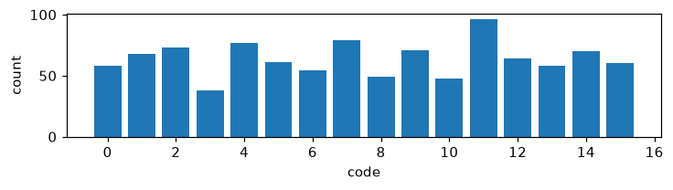

# Exp 5 — Delta-conditioned code (Δz input)

**Throughline:** [4 · +VICReg](../4-vicreg/) → **+delta-code** → [6 · fixed-start control](../6-fixed-start/)

## Reproduce

Trained 5000 steps on `bench`, seed 0, wandb online:

```bash
uv run python train.py model=minimal_latent loss=vicreg +model.inverse.delta_input=true
```

Exact resolved config (concrete, no overrides to reapply): [`config.yaml`](config.yaml).

Config delta from [Exp 4](../4-vicreg/): `+model.inverse.delta_input=true` makes the inverse model take only the latent change — the code is a function of `Δz = z_{t+1} − z_t` instead of `concat(z_t, z_{t+1})`, removing absolute-state information from the code's input.

## Hypothesis

If the codes were encoding absolute position, forcing the code to depend only on the latent *change* should strip out position and let the action emerge → NMI ↑.

## Results

| metric | value | vs Exp 4 |
|---|---|---|
| NMI(code, action) | 0.0135 | 0.0115 → ~unchanged |
| codes used / perplexity | 16 / 16, ppl 15.64 | — |
| z_std | 1.016 ✓ | — |
| no-action gap | 2.6e-3 | — |




## Interpretation

NMI essentially **unchanged** — the code is now a pure function of `Δz` and *still* doesn't track the action. The diagnosis sharpens: even `Δz` entangles position with direction, because in a generic CNN latent the change produced by "move left" depends on *where* the agent is. Bucketing the agent's position into a 4×4 grid confirms it:

> **NMI(code, position) = 0.064  vs  NMI(code, action) = 0.013**

The codes align ~5× more strongly with *where the agent is* than with *which way it moved*. The obstacle is the encoder's lack of position-invariance — now **confirmed, not conjectured**.

## Conclusion → next

Test the diagnosis directly with a positive **control**: pin the agent's start position so position can't vary, leaving the action as the only thing that changes across a transition. → [Exp 6](../6-fixed-start/).
