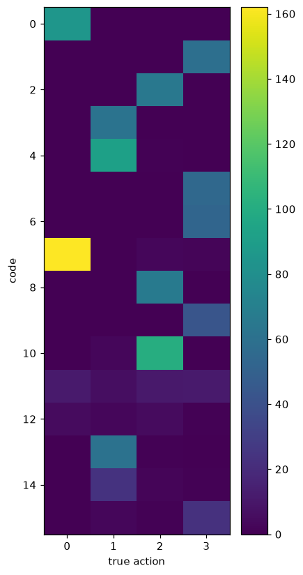
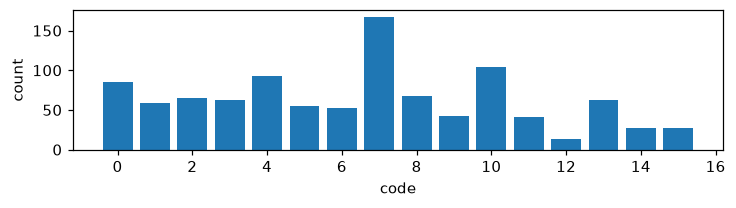
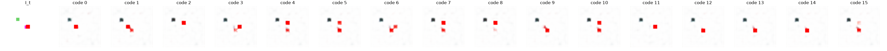

# Exp 6 — Fixed-start control (decouple position)

**Throughline:** [5 · +delta-code](../5-delta-code/) → **fixed-start control** → _next build: position-invariant encoder_

## Reproduce

Trained 5000 steps on `bench`, seed 0, wandb online (`fiery-cloud-5`):

```bash
uv run python train.py model=minimal_latent loss=vicreg \
    +model.inverse.delta_input=true '+data.env.start=[29,29]'
```

Config delta from [Exp 5](../5-delta-code/): `+data.env.start=[29,29]` pins the agent's spawn to a fixed cell every sample (distractors kept, so the VICReg variance term stays well-posed). Position is now constant — the only thing varying across a transition is the action. The [decoder probe](../../../../src/ssa/eval/decoder_probe.py) logs `counterfactual/decoded` after fit (`train.probe_steps`).

## Hypothesis

If position-entanglement is the *only* remaining obstacle, decoupling position (constant start) should let the same pipeline discover the four actions → NMI jumps toward the >0.8 target.

## Results

| metric (val) | random start (Exp 5) | **fixed start** |
|---|---|---|
| **NMI(code, action)** | 0.013 | **0.618** |
| ARI(code, action) | ~0 | **0.390** |
| no-action gap | 2.6e-3 | **0.030** (action → 42% lower err: 0.042 vs 0.073) |
| z_std / codes used | 1.02 / 16 | 1.02 / 16 |
| perplexity | 15.6 | 13.9 |





## Interpretation

With position decoupled, the pipeline (latent prediction + VICReg + delta-conditioned code) **genuinely discovers the four actions**: NMI jumps ~46× (0.013 → 0.62), ARI 0.39, and a large real no-action gap (the code cuts prediction error 42%). The confusion matrix is now action-selective (one action per code, ~4 codes per action), and the **decoded counterfactual** shows it in pixels — from a single `I_t`, each of the 16 codes decodes (via the dynamics model + the frozen-encoder decoder probe) to a distinct predicted agent displacement. This confirms both the diagnosis (the random-position failure was the position confound) and the method.

## Conclusion → next

Mechanism **validated**. To lift the *general* random-position toy toward this control, the encoder must be **position-invariant / object-centric** so "moved left" looks the same everywhere — turning the general toy into this (already-working) control. Secondary: sweep K / VICReg weights toward NMI > 0.8 in the control. See [RESULTS.md](../RESULTS.md) for the full synthesis.
