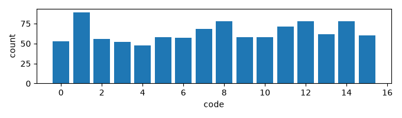
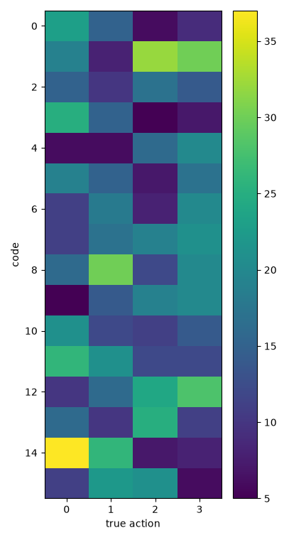
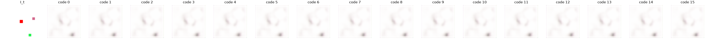

# Exp 7 — Position-invariant action inference

**Throughline:** [6 · fixed-start control](../6-fixed-start/) → **position-invariant inverse** → _next build: object-centric encoder / higher-res action features_

## Reproduce

Trained 5000 steps on `bench`, seed 0, wandb online (`invariant`, on the random-position toy):

```bash
uv run python train.py model=minimal_invariant loss=vicreg
```

Exact resolved config (concrete, no overrides to reapply): [`config.yaml`](config.yaml).

Config delta from [Exp 5](../5-delta-code/): `model=minimal_invariant` swaps the inverse model for `InvariantInverseModel` — the action is inferred from the inter-frame **feature-map** difference `features(I_{t+1}) − features(I_t)` via a small circular-padding conv + **global average pool over space**, so the inferred code is translation-invariant *by construction* (unit-tested exactly). Everything else (LatentHead + EMA teacher, VICReg, VQ, dynamics) is identical to the working control. A sanity run on the fixed-start setting (`+data.env.start=[29,29]`, wandb `invariant-fixed`) checks the new inverse doesn't regress the control.

## Hypothesis

If absolute-position entanglement is the only obstacle (Exp 5/6), making the *action inference* position-invariant should let the random-position toy discover the four actions — `NMI(code, action)` should rise from 0.013 toward the control's 0.62 (target ≥ 0.5), and `NMI(code, position)` should *drop* from 0.064.

## Results

Metrics regenerated from the checkpoint on the held-out val set (seed+1); position bucketed into a 4×4 grid via the agent's red centroid (as in Exp 5).

| Metric (val, random-position) | Exp 5 | **Exp 7 (invariant)** | target |
|---|---|---|---|
| **NMI(code, action)** | 0.013 | **0.027** | ≥ 0.5 ✗ |
| **NMI(code, position)** | 0.064 | **0.067** (≈ unchanged) | should drop ✗ |
| ARI(code, action) | ~0 | 0.007 | — |
| no-action gap | 2.6e-3 | 3.0e-3 | real ✓ |
| z_std / codes used | 1.02 / 16 | 1.01 / 16 | healthy ✓ |
| perplexity | 15.6 | 15.5 | — |

Sanity run (fixed-start, wandb `invariant-fixed`): **NMI 0.648, ARI 0.352, no-action gap 0.093** (action → 65% lower error) — *at or above* the Exp-6 control (0.618). The new inverse is sound.





## Interpretation

**The hypothesis is falsified for this mechanism.** On the random-position toy, `NMI(code, action)` rose only ~2× (0.013 → 0.027) — far short of ≥ 0.5 — and crucially `NMI(code, position)` stayed at **0.067 ≈ Exp 5's 0.064**: the codes still track position about as much as before. The decoded counterfactual confirms it — all 16 codes decode to nearly the same diffuse frame (no distinct per-code move), exactly like Exp 4/5.

Why the provably-invariant inverse didn't help in practice:
- The inverse is invariant to **circular shifts of the feature map** (unit-tested at atol 1e-5). But two transitions with the agent at different *absolute positions* do **not** have feature maps that are clean spatial rolls of each other — the encoder (zero-padded, strided, 64→**4×4**) encodes position in a way the global-average-pool can't cancel.
- The agent's move is **6 px ≈ 0.375 of a 4×4 feature cell** — *sub-cell*. At that resolution the difference signature of "move left" is aliased and position-dependent, so pooling it does not isolate the four clean directions.

In short: feature-map-translation-invariance ≠ agent-position-invariance in the learned 4×4 features. The fixed-start sanity (NMI 0.65) proves the inverse *can* discover actions when position is constant — the problem is unchanged: position is still entangled in the random case.

## Conclusion → next

Approach A (global-average-pool over the final feature difference) is **insufficient** on its own. Two concrete follow-ups, in order of expected leverage:

1. **Higher-resolution action features.** Infer the action from an earlier, finer encoder map (e.g. 16×16) instead of the 4×4 final map, so the 6-px move is resolvable and the pooled difference can isolate direction. Cheapest next experiment.
2. **Object-centric / slot encoder (Approach B from the spec).** Factor the scene into object slots with explicit positions and take the action as the *relative* change of the agent slot — position-invariance the encoder enforces, not just the pooling. The principled fix; heavier.

See [RESULTS.md](../RESULTS.md) for the synthesis. Verdict vs. the success bar: **not met** (NMI 0.027 ≪ 0.5; position NMI did not drop), but the result sharpens the diagnosis — the *encoder*, not just the action head, must be made position-invariant.
