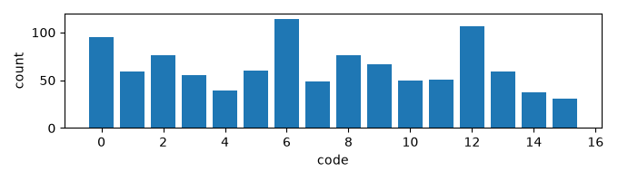
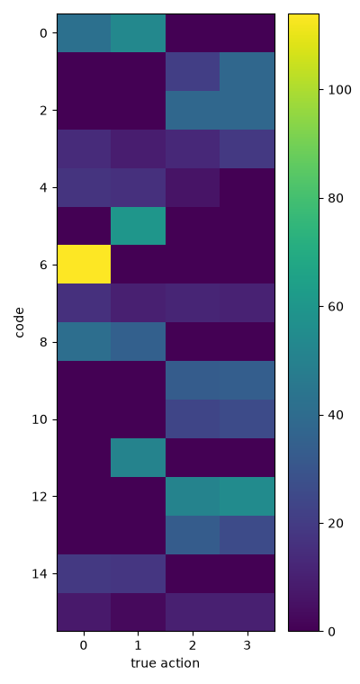
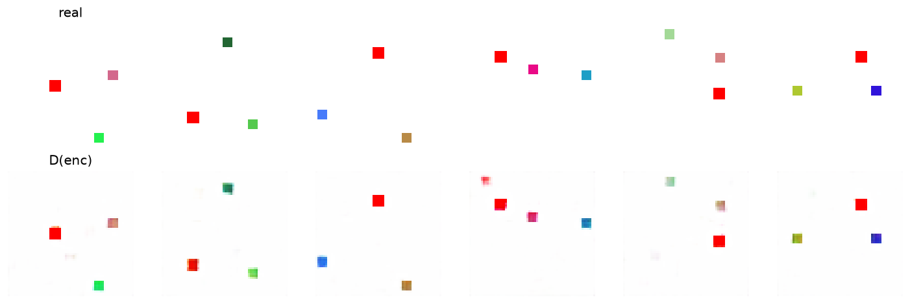
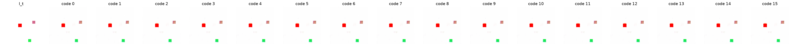

# Exp 8 — Higher-resolution action features

**Throughline:** [7 · invariant inverse](../7-invariant/) → **higher-res action features (16×16)** → _next: anti-aliased downsampling / explicit displacement readout (see [research](../../../../research/))_

## Reproduce

Trained 5000 steps on `bench`, seed 0, wandb online (`invariant-hires`):

```bash
uv run python train.py model=minimal_invariant_hires loss=vicreg
```

Exact resolved config (concrete, no overrides to reapply): [`config.yaml`](config.yaml).

Config delta from [Exp 7](../7-invariant/): the `InvariantInverseModel` now reads the action from an **earlier, finer encoder feature map** — `feat_level=2` → a `(64, 16, 16)` map — instead of the final `(256, 4, 4)` map (`feat_ch: 64`). Motivation: at 4×4 the agent's ~6-px move is *sub-feature-cell*, so the difference signature is aliased; at 16×16 a 6-px move is ~1.5 cells and resolvable. Everything else is identical to Exp 7.

## Hypothesis

Exp 7 showed the translation-invariant head didn't help because the 4×4 map is too coarse for the move. Reading the action from a finer (16×16) map should let the pooled feature-difference isolate direction → `NMI(code, action)` should rise and `NMI(code, position)` should drop.

## Results

Metrics regenerated from the checkpoint on the held-out val set (seed+1); position bucketed 4×4 via the agent's red centroid.

| Metric (val, random-position) | Exp 5 | Exp 7 (4×4) | **Exp 8 (16×16)** | control (Exp 6) |
|---|---|---|---|---|
| **NMI(code, action)** | 0.013 | 0.027 | **0.364** | 0.62 |
| **NMI(code, position)** | 0.064 | 0.067 | **0.044** (dropped) | — |
| ARI(code, action) | ~0 | 0.007 | **0.172** | 0.39 |
| no-action gap | 2.6e-3 | 3.0e-3 | **7.2e-3** | 0.030 |
| z_std / codes used | 1.02 / 16 | 1.01 / 16 | 1.00 / 16 | 1.02 / 16 |






**Decoder-probe note.** The probe was retrained for 3000 steps (the previous default of 500 left it undertrained — recon MSE stalls at ~5e-3 because reconstructing the agent at *arbitrary* positions is much harder than the fixed-start case; it converges to ~1e-5 by ~2.5k steps, so the default is now 3000). The reconstruction panel confirms the trained probe places the agent and the static distractors correctly. In the decoded counterfactual the distractors stay (correctly) static across all 16 codes while the agent's predicted next position varies only *subtly* per code — the pixel-space picture of NMI 0.36: real but partial action structure, not the crisp distinct per-code moves of the [fixed-start control](../6-fixed-start/).

## Interpretation

**The resolution diagnosis from Exp 7 was correct.** Moving the action readout from 4×4 to 16×16 lifted `NMI(code, action)` ~13× (0.027 → **0.364**) and, for the first time on the random-position toy, **`NMI(code, position)` dropped** (0.067 → 0.044) — the codes finally track the move more than the location. The confusion matrix shows real per-code action selectivity (code 6 → action 0, codes 5/1/11 → action 1, codes 9/10/12 → actions 2/3), a clear change from Exp 7's diffuse matrix. This directly confirms the anti-aliasing / tiny-object literature: a small object's motion lives in high spatial frequencies that aggressive downsampling aliases away (see [research](../../../../research/)).

**But it's still short of the bar** (NMI 0.36 < 0.5 target, < 0.62 control). The pooled feature-difference is fundamentally limited: global-average-pool discards the spatial peak that encodes the displacement, and a strided CNN is only approximately shift-equivariant (residual aliasing). The literature says the ceiling of the pooling approach is below an explicit displacement estimator.

## Conclusion → next

Higher-res features **work** (NMI 0.013→0.36, position decoupled) and are the right direction, but pooling caps out below target. The literature review ([`research/`](../../../../research/)) points to higher-leverage next moves, cheapest first:
1. **Anti-aliased downsampling** (BlurPool / APS) so the feature-difference is a cleaner translated delta.
2. **Explicit displacement readout** — soft-argmax cross-correlation / phase correlation between the two feature maps → a continuous (Δx, Δy), translation-equivariant by construction and sub-pixel — then VQ that.
3. **Shrink the codebook** (K=16 → ~6) and/or cheap **controllability losses** (selectivity, decorrelate-code-from-position, ~2.5% action supervision) — orthogonal, near-free.

See [RESULTS.md](../RESULTS.md) for the synthesis.
