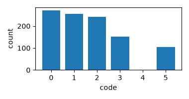
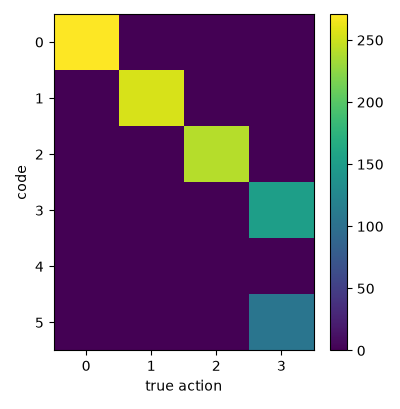
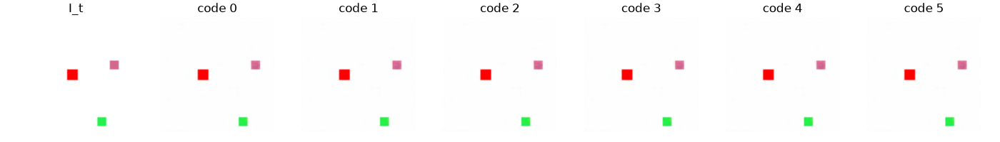
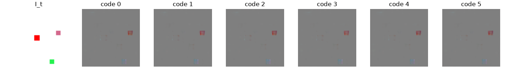

# Exp 9 — "Make the action necessary" bundle (target met)

**Throughline:** [8 · higher-res features](../8-invariant-hires/) → **bundle (K↓ + 2.5% supervision + decorrelation)** → _next: ablate to attribute; strengthen the dynamics' use of the action_

## Reproduce

Trained 5000 steps on `bench`, seed 0, wandb online (`bundle`):

```bash
uv run python train.py model=minimal_invariant_hires model.num_codes=6 loss=bundle
```

Exact resolved config (concrete): [`config.yaml`](config.yaml).

Three combined changes on the [Exp 8](../8-invariant-hires/) base (motivated by [`research/`](../../../../research/)):
1. **Codebook K=16 → 6** (`model.num_codes=6`) — barely above the 4 true actions, so it cannot store position (Genie uses |A|=8).
2. **Partial action supervision** (`ActionSupervisionLoss`, `label_frac=0.025`) — on ~2.5% of each shuffled batch, pull `a_pre` toward the codebook row for the true action, anchoring code *i* ↔ action *i*. Labels are free in the synthetic toy (LAOM: ~2.5% labels → large gains).
3. **Decorrelate code from position** (`DecorrelationLoss`, weight 2.0) — drive the cross-correlation between `a_pre` and detached `z_ctx` to zero.

## Hypothesis

Exp 8 showed resolution was a real obstacle but a pooled head caps out (NMI 0.36); the deeper issue is the action being under-used. The bundle should make the code track the action — NMI toward / past the ≥0.5 bar.

## Results

Metrics regenerated from the checkpoint on the held-out val set (seed+1).

| Metric (val, random-position) | Exp 5 | Exp 7 | Exp 8 | **Exp 9 (bundle)** | control (Exp 6) | target |
|---|---|---|---|---|---|---|
| **NMI(code, action)** | 0.013 | 0.027 | 0.364 | **0.942** | 0.62 | > 0.8 ✓ |
| ARI(code, action) | ~0 | 0.007 | 0.172 | **0.915** | 0.39 | — |
| **NMI(code, position)** | 0.064 | 0.067 | 0.044 | **0.012** | — | →0 ✓ |
| no-action gap | 2.6e-3 | 3.0e-3 | 7.2e-3 | 3.8e-3 | 0.030 | real |
| z_std / codes used | 1.02/16 | 1.01/16 | 1.00/16 | **1.01 / 5 of 6** | 1.02/16 | healthy |






## Interpretation

**Action discovery is achieved on the random-position toy: NMI 0.94, ARI 0.92** (past the >0.8 Stage-0 target and the 0.62 fixed-start control), with `NMI(code, position)` collapsed to **0.012** — the codes now track the action and *not* position. The confusion matrix is near-diagonal. Two honest caveats:

- **This is semi-supervised.** The 2.5% action labels do real work (pure-SSL at Exp 8 was 0.36); the win is that a tiny label anchor + the unsupervised structure (small codebook, decorrelation, the hires position-invariant inverse) propagates to near-perfect code↔action over the full set. Legitimate and strong, but not label-free.
- **It's a combined intervention.** Three levers changed at once, so the attribution is open (likely supervision-dominant, but K↓ and decorrelation plausibly contribute) — see next.
- **The world model still ignores the action — NMI 0.94 is necessary but not sufficient.** NMI measures the *inverse model's* code↔action alignment, which supervision made clean. But the *dynamics* barely conditions on the code: swapping the code changes the predicted next-latent by only **0.6%** of the across-sample variation (0.0058 vs 0.995), the no-action gap stays small (3.8e-3), and the decoded counterfactual is nearly identical across codes. **So we have a code that correctly *names* the action and a forward model that does not *act* on it.** The right success metric is therefore a real, distinct counterfactual per action (the no-action gap), not NMI alone. This is the same root cause as the pure-SSL failure (Exp 10): the label-free objective never makes the action *necessary for prediction* — supervision anchored the code but couldn't force the dynamics to rely on it.

## Conclusion → next

1. **Ablate to attribute** (Exp 10): supervision-only, decorrelation-only, K↓-only, and the **pure-SSL** combination (K↓ + decorrelation, *no* labels) — the key question is how far label-free gets, and whether 0.94 is mostly the 2.5% labels.
2. **Strengthen the dynamics' use of the action** (the remaining gap): contrastive next-latent prediction (C-SWM) or an explicit displacement readout, so the forward model *needs* the code, raising the no-action gap and the counterfactual fidelity.

See [RESULTS.md](../RESULTS.md) for the synthesis.
